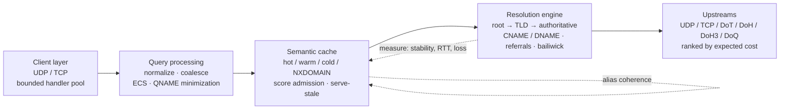
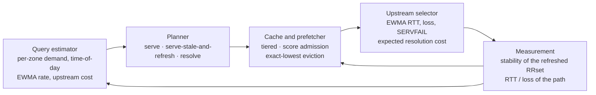

# RecurseX

*[中文文档](README_CN.md)*

RecurseX is a recursive DNS resolver written in Rust. It walks the delegation
tree the way BIND and Unbound do, so if you have ever read `named.conf` you
already know what it does. What is different is what it does *with the data it
has seen*: every cached RRset carries a measured history, every cache decision
is taken from a score computed by one function, and every table in the resolver
has a bound that an attacker cannot push past.

The resolver is not a `HashMap<query, answer>`. That is the whole point.



## TTL is a claim, stability is a measurement

An authoritative server tells you what it *asserts* about a record's lifetime.
It does not tell you how often the record actually changes, and those are
different quantities. A `TTL 3600` on a record that rotates every five minutes
and a `TTL 3600` on a record that has not moved in six months cost the same
amount of memory and deserve completely different treatment:

- the volatile one should not be trusted when it is stale, should be refreshed
  early and often, and is not worth occupying a hot slot;
- the stable one can be refreshed in the background on a schedule nobody
  notices, and is safe to serve-stale while that happens.

RecurseX measures the second quantity. Each cache entry owns a
`StabilityModel`: sample count, change count, an EWMA stability score, a
long-run change ratio, an EWMA of the authoritative TTL and of its volatility,
and consecutive refresh failures. A refresh compares the new RRset against the
old one *by content* (TTLs excluded — a TTL-only change is not a data change),
and that comparison is what moves the model.

**The measured history never touches the TTL you serve.** If the authority says
300, the client gets 300. Stability only moves internal timing: when to
prefetch, whether to serve stale, which tier to admit to, and what to evict.
That separation is a hard rule in this codebase, not a guideline — nothing in
`stability.rs`, `planner.rs` or `cache/score.rs` can write a TTL.

## The loop

The four stages are wired into each other, not merely next to each other:



The estimator answers one question the planner actually asks:
`P(a query for this zone within the next 60 seconds)`. It builds that from a
per-zone 96-bucket time-of-day profile (15-minute buckets) plus a short-term
recency term, and combines them with the larger of a Poisson demand estimate
and an EWMA inter-arrival rate. Serve-stale requires `p >= 0.5` *and* a mature,
very stable entry; anything else resolves synchronously. That is the entire
"prediction" — a probability and a stability score, both of which are
recomputed from observations, and both of which can say "I don't know".

## What actually happens to a query

1. **The server** reads a datagram in a receiver thread and hands it to a
   bounded work queue. Resolution threads pick it up. If the queue is full the
   datagram is shed and a counter records it — overload degrades into dropped
   packets, never into unbounded memory or an unbounded number of threads.
2. **Policy** validates the message (opcode, exactly one question, label
   count, no zone transfers), applies the token bucket for that client, and
   checks the blocklist.
3. **Coalescing**: the first thread to ask for `(name, type, class, ECS, DO)`
   becomes the owner and resolves; everyone else parks on its slot and reads
   the same answer. The in-flight table is bounded (`max_inflight`), and the
   owner *always* publishes — `Owner::drop` publishes an error if the
   resolution unwinds, so a waiter cannot hang on a slot nobody will fill.
4. **Cache first**: exact key, then the ECS-less key, then a CNAME for the
   same name, then the NXDOMAIN store. A hit that is fresh is served; a hit
   that is expired but inside the stale window goes to the planner, which
   either serves it stale (and queues a refresh) or sends the query onward.
5. **Resolution**: QNAME minimization from the deepest zone it knows, a
   referral walk with bailiwick filtering, CNAME/DNAME chasing, and the
   expected-cost upstream ranking at every hop. Truncated UDP answers are
   retried over TCP.
6. **Caching**: the answer is split into RRsets and inserted with an admission
   score built from the estimator's popularity and cost signals for that zone.
7. **Serving**: the response is truncated to the client's advertised EDNS
   buffer in a single serialization pass, with TC set and the OPT record
   preserved when records had to go.

## Design notes

### One scoring function, one eviction rule

`cache::score::score` is the only place a cache score is computed. Admission,
re-scoring on a serve, and eviction ranking all call it with the same
arguments, so an entry's tier and its position in the eviction order cannot
disagree:

```
score = 0.30·popularity + 0.18·locality + 0.20·stability
      + 0.16·ttl        + 0.11·cost     − 0.05·memory
```

Thresholds: hot at 0.72, warm at 0.35, cold at 0.15; below 0.15 the entry is
not cached at all.

Eviction is *exact*, not sampled: each tier keeps a secondary index keyed by
`(quantized score, key)`, so the lowest-scored entry is found and removed in
`O(log n)`. That index exists for a specific reason — the obvious
implementation ("scan the tier, take the minimum") is `O(n)` per insert once
the cache is full, which makes filling a cache `O(n²)` and turns the insert
path into an amplification vector for anyone who can force evictions.
Switching tiers costs at most one eviction plus one demotion step
(`spill`), and demotion is deliberately *not* recursive: a cascading demotion
would make the cost of a single insert unbounded.

### The alias graph answers the reverse question

A cache can tell you what is stored under a key. It cannot tell you what else
depends on that key, because "depends on" is not a property of a map entry.
For DNS that relation is pervasive: a resolver serves `www.example.com A`
from cache only while *both* the CNAME at `www` and the target's address data
are fresh. Refresh the target and let the CNAME expire a minute later, and the
next client query still pays for a resolution — the prefetch did half a job.

`src/alias.rs` records exactly that relation (`(owner, CNAME) → (target, type)`)
in both directions. `Resolver::refresh_with_dependents` uses the reverse
direction, and it is called from both refresh triggers: the predictive
prefetcher, and a serve-stale hit in the request path. The graph is bounded by
edge count, and the maintenance task prunes it by age and samples its size into
the statistics.

An earlier revision of this module was a general resolution graph with zone,
nameserver and server-address nodes. Every resolution step paid to write edges
that no decision ever read. It was replaced by the structure above, which has
one relation, one purpose and one consumer — if a data structure has no
reader, it is not a design, it is a cost.

### Upstream selection prices retransmission

Ranking servers by RTT is wrong. A server that is fast 92% of the time can cost
more *in expectation* than a slightly slower server that never fails, once
retransmissions are counted:

```
cost = rtt_ewma + setup_rtts·rtt_ewma + RTO·p_loss/(1−p_loss) + 1.5·RTO·p_servfail
RTO  = max(rtt_ewma + 4·rtt_variance, 25 ms)
```

Two details that are easy to get wrong and are pinned by tests here:

- **A failed first contact must be recorded.** `record_timeout` and
  `record_servfail` create the path model if it does not exist. The naive
  version (update only known paths) leaves a black-holed server ranked by the
  optimistic prior forever, so the resolver dials it first on every query.
- **An unmeasured path is ranked by the best case it could achieve**, not by a
  pessimistic guess: unknown paths sort ahead of measured ones and get probed
  exactly once, after which their own measurements decide.

### Bounds, and what each one is defending against

| Table | Default cap | Why |
| --- | --- | --- |
| cache hot / warm / cold | 2 048 / 131 072 / 32 768 entries | working set, not a leak |
| NXDOMAIN store | 65 536 names | the cheapest entry to make: any random name produces one |
| estimator zones | 100 000 apexes | random subdomain floods |
| upstream paths | 4 096 endpoints | NS-set floods from hostile delegations |
| client buckets | 65 536 clients | spoofed-source floods (see the honest note below) |
| in-flight queries | 4 096 keys | coalescing table |
| concurrent refreshes | 8 threads | serve-stale hits queue refreshes from the request path |
| alias edges | 100 000 | CNAME chains |
| sections in a message | 4 096 records, 16 questions | parse cost is linear in message size |
| names | 255 octets, 127 labels, 128 pointer hops | wire format, with a proof that 128 hops cannot reject a valid name |
| UDP response | the client's advertised EDNS size, floor 512 | no oversized datagrams, no reflection amplification |

Filling any of these tables is `O(1)` amortized per insert (`src/bounded.rs`):
a stale-entry pass that costs nothing to run when the table is healthy, and a
stride sweep that fires only when the table is full of *live* entries. The one
thing no table does is scan itself on the insert path.

### The wire parser trusts nothing

- Section counts are bounded before any loop starts, and every length field is
  validated against the message buffer.
- Compression pointers must move strictly backwards within the message; the
  hop budget is derived from the 255-octet name limit (each hop contributes at
  least two octets), so the guard rejects every loop while never rejecting a
  name the wire format can legitimately express.
- Name compression is only emitted for offsets below 0x4000 — the 14-bit
  pointer field is a hard limit, and a large TCP response that grows past it
  stops compressing instead of writing a truncated pointer.
- Records whose RDATA does not fit a 16-bit length field after re-encoding are
  reported as errors. Silently truncating the length would hand a client a
  corrupt message, which is worse than a SERVFAIL.

### One mechanism per job

Several things in this codebase exist once, on purpose, and the code says so:

- the score function (not one for admission and one for eviction),
- the coalescing table (there is no second one counting waiters),
- the alias graph (the general graph is gone rather than kept unread),
- the refresh path (`refresh_with_dependents` is what both triggers call),
- the capacity sweeps (`src/bounded.rs` is used by four tables),
- the DNSSEC verification routine (`validate_rrset` is what the chain walker
  calls).

## What this does not do

Said plainly, because the alternative is a README that implies more than the
code delivers:

- **DNSSEC algorithms**: RSASHA256 (8) is fully verified from scratch. SHA-1
  algorithms (5/7) are refused as deprecated. ECDSA (13/14) and EdDSA (15/16)
  are recognised but not verified by this build — signatures from zones that
  only use them produce `Indeterminate`, never a fabricated "secure".
- **DNSSEC scope**: `Secure` means "an RRSIG over this data verified against a
  DNSKEY that matches the signer's DS in the parent zone". The DNSKEY and DS
  lookups ride the same hardened path as every other query, but this build
  ships no root trust anchor and does not validate the DS RRset's own
  signature, and nested lookups deliberately skip validation to bound
  recursion. There are no NSEC/NSEC3 proofs, so negative answers are not
  authenticated. If you need a chain anchored at the IANA root, that work is
  not in here yet.
- **DoQ**: QUIC v1 (RFC 9000/9001/9002) and DoQ framing (RFC 9250) are
  implemented in this crate on top of courierust's public packet/CRYPTO
  codecs, X25519, HKDF and signature verification. The handshake completes
  against a courierust H3 server over loopback. Against the two public DoQ
  resolvers we tested, the handshake flight arrives as a single datagram larger
  than 1500 bytes and the path to them dropped 1400-byte UDP packets 50–66% of
  the time on our network, so we could not complete a handshake with them from
  here — that is a path-MTU observation, not a claim about the code.
- **Server side**: the client-facing server speaks plain UDP and TCP only.
  DoT/DoH/DoH3/DoQ are upstream transports; there is no DNS-over-HTTPS
  endpoint.
- **Time**: `tzcraft` carries no IANA timezone database, so the estimator's
  time-of-day profile is wall-clock UTC.
- **Persistent cache**: the `persist` feature writes a whole snapshot
  atomically on an interval. Writes are not incremental.
- **Transport sockets**: upstream UDP opens one socket per exchange and TCP
  opens one connection per exchange. That gives per-query source-port
  randomisation for free; it is not a connection-pooled design, and a pool is
  the obvious next step if you need to push tens of thousands of queries per
  second per core.
- **Rate limiting is per source IP**, so it is best-effort by construction: a
  spoofing flood gets a fresh bucket per packet. What is guaranteed is the
  bound — the bucket table stays capped and evicting an idle bucket is free
  (it would have refilled to capacity anyway), so a flood costs a bounded
  amount of memory and CPU rather than unbounded work per packet.

## Building

Rust 1.78 or newer (the CI matrix runs the MSRV and stable):

```sh
cargo build --release                       # everything, default features
cargo build --no-default-features           # no_std + alloc algorithmic core
cargo test --all-features                   # 166 tests + 4 doctests
cargo run --example quick_check             # live resolution, needs network
```

Default features are `std`, `dot`, `doh`, `doh3`, `doq`, `dnssec`, `persist`.
The algorithmic core (wire codec, cache, estimator, alias graph, upstream
model, planner, stability) compiles without `std`; the networked resolver,
server, config and transports are `std`-gated.

## Using it

```rust
use recurse_x::{Name, RrType, Resolver, ResolverConfig};

let resolver = Resolver::new(ResolverConfig::default());
let name = Name::from_ascii("ietf.org").unwrap();
match resolver.resolve(&name, RrType::A) {
    Ok(res) => {
        // res.answers, res.ttl, res.validated, res.from_cache, res.stale
        for r in &res.answers {
            println!("{} {:?}", r.name, r.rdata);
        }
    }
    Err(e) => eprintln!("resolution failed: {e}"),
}
```

A client-facing server is two lines on top of that:

```rust
use recurse_x::{Resolver, ResolverConfig, Server};

let server = Server::new(Resolver::new(ResolverConfig::default()));
let addr = server.bind_udp("127.0.0.1:5353".parse().unwrap())?;
server.bind_tcp("127.0.0.1:5353".parse().unwrap())?;
// dig @127.0.0.1 -p 5353 example.com A
```

Every loop the server and the resolver start can be stopped. `shutdown()` sets
one flag that the UDP receivers, handlers, accept loop, per-connection readers
and the maintenance loop all poll, so `join()` returns instead of leaving
threads parked on a socket that will never speak again:

```rust
server.shutdown();
resolver.shutdown();
server.join();               // returns once every loop has exited
```

That is what makes the process exit path clean: a maintenance thread that was
sleeping for a minute still stops within 100 ms, and it writes a final cache
snapshot on the way out when `persist` is enabled.

Background maintenance (cache sweep, alias prune, predictive prefetch) is a
thread you start explicitly:

```rust
let _handle = resolver.spawn_maintenance();
```

### Configuration

The whole resolver is configurable from one JSON document. Every field is
optional, and an absent field falls back to the resolver default rather than to
zero — a minimal document cannot accidentally disable QNAME minimization,
zero a timeout, or empty the cache:

```json
{
  "listen": [{ "addr": "0.0.0.0:53", "proto": "udp" }],
  "cache": { "hotCapacity": 2048, "warmCapacity": 131072, "nxCapacity": 65536 },
  "engine": {
    "qnameMinimization": true,
    "use0x20": true,
    "dnssec": true,
    "rootServers": ["127.0.0.1:5353"],
    "forwarders": [
      { "proto": "dot", "ip": "1.1.1.1", "port": 853, "host": "cloudflare-dns.com" }
    ]
  },
  "persist": { "path": "/var/lib/recursex/cache.rxc", "saveIntervalMs": 60000 }
}
```

`rootServers` takes `ip` or `ip:port`, so a local unbound/knot instance (or a
test stub) can stand in as the entry point of the tree. Forwarders are tried in
order until one answers with a matching ID and question. Configuring any
forwarder switches the resolver to forwarding mode: a forwarder that cannot be
reached is reported as an error rather than quietly turning into a full
iterative resolution, because the two have different answers to "who sees this
query" — a deployment forwarding to a filtering resolver must not bypass it.
Encrypted forwarders require their `host` (the TLS identity used for SNI and
certificate verification); a document that omits it is rejected at load time
instead of running without an identity. Secure them with trust anchors through
`Resolver::set_forwarder_roots`.

### Examples

| Example | What it demonstrates |
| --- | --- |
| `quick_check` | live end-to-end resolution plus the second pass from cache |
| `multi_type_resolve` | A / AAAA / MX / TXT / NS / SOA for one name |
| `server_demo` | a local UDP+TCP server with JSON configuration |
| `custom_config` | a strict resolver built entirely in code |
| `forward_resolver` | forwarding over DoT and plain UDP |
| `persist_cache` | L3 snapshot: a warm cache survives a restart |

```sh
cargo run --example multi_type_resolve
cargo run --example server_demo      # blocks; query it with dig -p 5353
```

## Repository map

| Path | What lives there |
| --- | --- |
| `src/name.rs`, `src/message.rs`, `src/rdata.rs`, `src/edns.rs` | wire format: names, compression, messages, all RR types, EDNS(0) |
| `src/cache/` | tiered cache, admission scoring, L3 snapshot (`persist`) |
| `src/estimator.rs`, `src/planner.rs`, `src/stability.rs` | the predictive half: demand, decisions, measured history |
| `src/alias.rs` | alias dependencies between cached answers |
| `src/upstream.rs`, `src/transport.rs`, `src/transports/` | path models and the transports behind them |
| `src/resolver.rs` | the resolution loop, coalescing, maintenance |
| `src/server.rs` | client-facing UDP/TCP server |
| `src/policy.rs`, `src/entropy.rs`, `src/prng.rs` | rate limiting, OS entropy, PRNG/SipHash primitives |
| `src/bounded.rs`, `src/float.rs` | capacity sweeps; the `no_std` float helpers the MSRV needs |
| `tests/` | integration tests against the public API, plus the parser's adversary |
| `wiki/` | longer-form design notes, including the [PARR loop](wiki/PARR.md) |

## Tests and CI

There are 159 unit tests, 7 integration tests in `tests/`, and 4 doctests, and
the suite does not need the public Internet: upstreams in the tests are local
stub servers, so `cargo test` is hermetic. What is covered includes the wire
codec (including rejection cases), cache admission/eviction/serve-stale/
persistence, the estimator's `exp` implementation against reference values,
planner decisions, the alias graph's both directions and pruning, upstream cost
selection, the coalescer (including an owner that vanishes without publishing),
UDP truncation to the advertised size, the server's end-to-end UDP/TCP paths,
DNSSEC RSA verification against an openssl-generated vector, and the self-tests
of the float helpers.

The integration tests are the ones an embedder cares about: they build a
resolver from a JSON document, serve it over UDP *and* TCP, assert the second
query is answered from cache without touching upstream, restart a process from
its `persist` snapshot, and stop everything through the public shutdown API.
`tests/wire_robustness.rs` feeds the decoder 20,000 deterministic pseudo-random
buffers plus hostile count fields, compression-pointer cycles and every
truncation boundary, and asserts the parser never panics and that anything it
accepts survives a re-encode/re-parse round trip.

CI runs, on the MSRV toolchain (1.78) and on stable, for Linux and Windows:

- `fmt` — `cargo fmt --all -- --check`.
- `clippy` — `-D warnings` for all targets with all features, for the `no_std`
  core, and for `std` without the transports.
- `doc` — `cargo doc` with `RUSTDOCFLAGS=-D warnings`, plus the doctests with
  all features and with none.
- `test` — the suite with all features, with default features, and in release
  mode; the release profile is what ships (fat LTO, one codegen unit).
- `features` — a build for the `no_std` core, for `std` alone, for each
  optional feature on its own, and for everything together.
- `release` — the release build plus the examples in both release and the
  `no_std` configuration.
- `package` — `cargo package`, so the tarball that would be published builds
  on its own.

All warnings are errors in every job: `RUSTFLAGS=-D warnings` applies to this
crate, and Cargo caps dependency lints, so a new dependency warning cannot turn
the build red.

## Security notes

- **Spoofing defence is layered**: transaction ID drawn from an OS-seeded
  SplitMix64 that is reseeded every 4096 draws, 0x20 QNAME case randomisation
  (on by default), response matching on ID *and* echoed question, unconnected
  UDP sockets so a response from an unexpected source is ignored, and bailiwick
  rules that decide what may be cached from any response.
- **Reflection**: the UDP server never sends a datagram larger than the
  client's advertised EDNS buffer, and it never answers with more data than the
  client asked for.
- **Input handling**: the parser rejects malformed packets before any
  allocation of consequence, and every table that a hostile query stream can
  reach is capped (see the bounds table).
- **Honest limits**: the per-client rate limiter is keyed by source address and
  therefore defeatable by spoofing; the DNSSEC verdicts are bounded by the
  algorithm support and trust model described above; the `persist` snapshot is
  validated for structure but is not authenticated.

## License

Apache-2.0.
