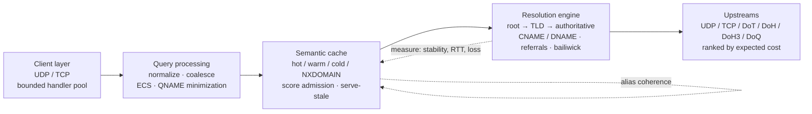
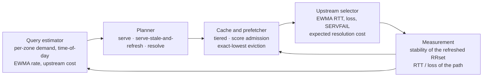

# RecurseX

*[中文文档](README_CN.md)*

RecurseX is a recursive DNS resolver written in Rust. It walks the delegation
tree the way BIND and Unbound do, so if you have ever read `named.conf` you
already know what it does. What is different is *how it decides to trust what
it already holds*: an expired cache entry is served only when a conservative
probability bound, a consequence class and an aggregate risk budget all agree,
and the entry is refreshed where refreshing actually changes that bound.

The resolver is not a `HashMap<query, answer>`. That is the whole point.

> The design and the argument behind it are written up in
> **[`paper/RecurseX-risk-constrained-refresh.md`](paper/RecurseX-risk-constrained-refresh.md)**
> and, at implementation depth, in the wiki's
> [Risk-constrained refresh](wiki/Refresh-Theory.md).


```mermaid
flowchart LR
    A["Client layer<br/>UDP / TCP<br/>bounded handler pool"] --> B["Query processing<br/>normalize · coalesce<br/>ECS · QNAME minimization"]
    B --> C["Semantic cache<br/>hot / warm / cold / NXDOMAIN<br/>score admission · serve-stale"]
    C --> D["Resolution engine<br/>root → TLD → authoritative<br/>CNAME / DNAME · referrals · bailiwick"]
    D --> E["Upstreams<br/>UDP / TCP / DoT / DoH / DoH3 / DoQ<br/>ranked by expected cost"]
    C -. "alias coherence" .-> C
    D -. "measure: stability, RTT, loss" .-> C
```

## A TTL is a claim; the change rate is a measurement

An authoritative server tells you what it *asserts* about a record's lifetime.
It does not tell you how often the record actually changes, and those are
different quantities. A `TTL 3600` on a record that rotates every five minutes
and a `TTL 3600` on a record that has not moved in six months cost the same
amount of memory and deserve completely different treatment.

Earlier versions of this resolver tried to close that gap with an EWMA
"stability score". That was wrong, and the reasons are worth keeping: the
score was not a probability (so the thresholds on it were arbitrary), it
ignored the sampling cadence (ten looks two seconds apart and ten looks over
ten hours produced the same number), and it could not be conservative (an EWMA
moving away from a neutral `0.5` makes a barely-observed name look *more*
trustworthy the less it has been watched).

What replaced it is a **posterior over the change rate**, and a **one-sided
credibility bound** on it:

```
Pr(Y = 1 | λ, h) = 1 − e^(−λh)        observations: an exposure h and an outcome Y
Pr(Y = 0 | λ, h) = e^(−λh)            λ | data  ~ Gamma(α, β),  α = α₀ + Σ w·Y,  β = α₀T + Σ w·h

P_LCB(fresh, Δ) = e^(−λ_hi·Δ)         λ_hi = the exact Chernoff bound on Gamma(α, β)
```

Read that last line as a sentence: *even taking the most pessimistic change
rate still consistent with what we have observed, the probability this data is
correct `Δ` seconds from now is at least this.* That is a claim a safety
argument can be built on, and it is what every stale decision consumes.

Three consequences are worth naming:

- **Irregular sampling is modelled, not averaged away.** The likelihood
  conditions on each observation's own exposure, so a resolver that looks
  often and a resolver that looks rarely draw different inferences from the
  same zone — which is correct — instead of the same unitless number, which
  is not.
- **`Y = 0` does not mean "nothing happened".** It means no visible
difference was found at that sample; a change that came and went between two
samples is invisible. That is why the output is a distribution and why the
model keeps no "change count" in its state at all.
- **A failed refresh is not evidence of stability.** Recording a timeout as
  "unchanged" would make an unreachable upstream masquerade as a stable zone,
  and the resolver *more* willing to answer from memory the worse the network
  got. Failures age the evidence and teach the model nothing.

### Forgetting is also an anti-forgery bound

Evidence is exponentially forgotten with a time constant `τ` (one day by
default), because DNS data is not stationary. That has a second effect worth
stating plainly: forgetting puts a **hard ceiling** on accumulated evidence
(`b → wτ`). No quantity of refreshes — honest or forged — can drive the
change rate to zero, so the credibility bound never closes and `P_LCB` is
strictly below 1 for every entry that has ever existed. An attacker in a
position to answer our refreshes cannot manufacture unbounded confidence that
a name never changes, because the model never accumulates unbounded
confidence in anything. It is a property of the update rule, not a check
bolted on afterwards.

The second half of the same defence: an answer accepted on the strength of
ID, port and 0x20 case alone is worth half an authenticated one in the
statistics, and because the weight scales the *ceiling* as well as the rate,
an unauthenticated channel can never buy the same confidence however long it
is observed.

**The measured history never touches the TTL you serve.** If the authority
says 300, the client gets 300. The model only moves internal timing: when to
refresh, whether stale may be served, which tier to admit to, what to evict.
That separation is a hard rule in this codebase, not a guideline.

### Value and safety are different questions

The tempting gate for serve-stale is *"is this name popular?"*. It is wrong,
and wrong in the direction that hurts: popularity measures the **benefit** of
an answer and is silent about its **safety**, so applying it means the busiest
zone in a deployment is the one most likely to be answered from a copy that a
decommissioned nameserver or a revoked key has invalidated. The failure is
correlated with traffic, which is the shape of an outage.

So the two questions are answered separately. **Value** (expected saved
latency) decides what is worth refreshing and in what order. **Risk** decides
whether stale may be served at all:

```
R = V · (1 − P_LCB(fresh, a)) · C · κ(trust)

C  ∈ {1 (A/AAAA), 5 (CNAME), 25 (MX/SRV), 100 (NS/glue), ∞ (DNSKEY/DS/NSEC)}
κ  ∈ {1 chain-anchored, 2 crypto-verified, 5 unverified, 10 indeterminate}
```

The classes are not decoration. The *same* A record is cheap as answer data
and `Critical` as glue, because stale glue poisons every later query beneath
that zone. And key material is `∞`: a stale proof of existence is not a
freshness failure, it is a security failure — it can resurrect a revoked key.

Every admitted stale answer charges an aggregate **risk budget**, and every
spawned refresh charges a **refresh budget**. Both are leaky/token buckets, so
the constraints hold by construction rather than on average, and both export
their denial counts — because "the policy is the constraint" and "the network
is the constraint" need opposite fixes.

### A refresh is only useful at the bottleneck

An answer is assembled from several entries — a CNAME, its target, a
delegation, a nameserver address, a DNSSEC proof — and it is correct only if
all of them are. The conservative bound is therefore the **minimum** over
them, not their product: one authoritative republish changes a CNAME and its
target in the same instant, so an independence assumption would understate the
risk.

The minimum has a consequence that changes the scheduler: **refreshing
anything except the weakest link cannot raise the bound at all.** A prefetcher
that refreshes every expiring member of a chain spends its whole budget and
improves the guarantee by exactly zero whenever the same member stays weakest.
So the refresh plan is ordered bottleneck-first, and every entry reports what a
refresh of it would actually buy, letting a caller stop when the marginal
refresh stops mattering.

## Where the refresh budget goes

The bottleneck argument says *which* entry to refresh. It does not say which
entry to refresh **next**, and the maintenance loop holds a finite budget —
`RefreshBudget` mints tokens at a fixed rate — so that second question is the one
that decides the outcome. The answer used to be "the entry with the lowest
`P_LCB`", and that is a threshold, not an allocation. A threshold can only say
"look at this too"; it is blind to how much an observation would *teach*, to how
much the answer is *worth*, and to how much harm the record's class can do.

All three are visible to the risk functional the rest of the system already
uses, so the scheduler prices an observation by the **expected reduction in
risk** it produces:

```text
R   = V · (1 − p) · C · κ
VoI = R(do nothing) − E[R(after observing)]
```

with both sides evaluated at the horizon, and the expectation over the two
outcomes an observation can have — the data changed, or it did not — weighted by
the model's own predictive probability `p₀ = (β / (β + age))^α`.

What makes the number trustworthy is how the "after" state is obtained: by
cloning the hazard model and calling **the same `observe` the real refresh path
calls**. Not a re-derivation of the conjugate update — a second source of truth
whose failure mode would be silent, ranking by an update the model never
performs.

Three properties fall out that a threshold simply does not have:

- **An observation of something you just observed is worth zero.** A refresh
  reports the exposure since the last observation, so confirming a one-minute-old
  fact carries almost no evidence and confirming an hour-old one carries a great
  deal. Both can have the same `P_LCB` when the scheduler runs. Asserted by
  `looking_at_something_we_just_looked_at_buys_nothing`.
- **Value is monotone in what is at stake** — in the consequence class, in the
  trust penalty, and in the saved latency `V`. A record nobody waits for is not
  worth a token however uncertain its model is.
- **Value never exceeds the risk of not acting.** An observation can only remove
  risk.

Each observation costs one token, so the best allocation is the top-N by value —
the work is in computing the values, not in the selection, and the selection is
not dressed up as more than a sort. What the scheduler *does* add on top is a
**per-class reservation**: a pure value sort starves, and starvation here is
self-reinforcing, because an entry that is never observed has its evidence decay
by design, so its bound widens, so it can no longer be **served stale** when a
lookup arrives. The guarantee is stated exactly and tested side by side with the
starvation it prevents: if the budget is at least `classes × reservation`, every
class contributes at least `reservation`.

Prediction is used for the *value* and the credibility bound for *safety*. That
is not an inconsistency — a value is an expectation and asking "what will we
learn, on average" is exactly right; a safety decision asks "what is the
probability we are wrong" and a mean is not a guarantee. The same split already
separates `CacheScore` from `risk`. [The derivation, the honest limits and a
worked value are in the wiki](wiki/Value-of-Information.md).

## The loop

The four stages are wired into each other, not merely next to each other:


```mermaid
flowchart LR
    E["Query estimator<br/>per-zone demand, time-of-day<br/>EWMA rate, upstream cost"] --> P["Planner<br/>serve · serve-stale-and-refresh · resolve"]
    P --> C["Cache and prefetcher<br/>tiered · score admission<br/>exact-lowest eviction"]
    C --> U["Upstream selector<br/>EWMA RTT, loss, SERVFAIL<br/>expected resolution cost"]
    U --> M["Measurement<br/>stability of the refreshed RRset<br/>RTT / loss of the path"]
    M --> E
    M --> C
```

The estimator answers one question the *value* side of scheduling asks:
`P(a query for this zone within the next 60 seconds)`. It builds that from a
per-zone 96-bucket time-of-day profile (15-minute buckets) plus a short-term
recency term. That probability gates whether a background refresh is worth a
slot; it never gates whether stale data may be served, because a cache hit
being cheap says nothing about whether it is safe.

The safety side is the hazard model and the risk budget above. It is
deliberately blind to the estimator: a test exists whose only purpose is to
make a future change that reintroduces the dependency have to delete the test
on purpose.

## What actually happens to a query

1. **The server** reads a datagram in a receiver thread and hands it to a
   bounded work queue. Resolution threads pick it up. If the queue is full the
   datagram is shed and a counter records it — overload degrades into dropped
   packets, never into unbounded memory or an unbounded number of threads.
2. **Policy** validates the message (opcode, exactly one question, label
   count, no zone transfers), applies the token bucket for that client, and
   checks the blocklist.
3. **Coalescing**: the first thread to ask for `(name, type, class, ECS, DO)`
   becomes the owner and resolves; everyone else parks on its slot and reads
   the same answer. The in-flight table is bounded (`max_inflight`), and the
   owner *always* publishes — `Owner::drop` publishes an error if the
   resolution unwinds, so a waiter cannot hang on a slot nobody will fill.
4. **Cache first**: the requester's ECS partition, then every broader ECS
   scope that contains it, then the global partition; then a CNAME for the
   same name, then the NXDOMAIN store. A hit that is fresh is served; a hit
   that is expired but inside the stale window goes to the planner, which
   either serves it stale (and queues a refresh) or sends the query onward.
5. **Resolution**: QNAME minimization from the deepest zone it knows, a
   referral walk with bailiwick filtering, CNAME/DNAME chasing, and the
   expected-cost upstream ranking at every hop. Truncated UDP answers are
   retried over TCP.
6. **Caching**: the answer is split into RRsets and inserted with an admission
   score built from the estimator's popularity and cost signals for that zone.
7. **Serving**: the response is truncated to the client's advertised EDNS
   buffer in a single serialization pass, with TC set and the OPT record
   preserved when records had to go.

## Design notes

### One scoring function, one eviction rule

`cache::score::score` is the only place a cache score is computed. Admission,
re-scoring on a serve, and eviction ranking all call it with the same
arguments, so an entry's tier and its position in the eviction order cannot
disagree:

```
score = 0.30·popularity + 0.18·locality + 0.20·durability
      + 0.16·ttl        + 0.11·cost     − 0.05·memory
```

The `durability` term is the model's estimate over a one-minute horizon, and
it is the only term with a calibrated meaning. The score as a whole is a
**value** function — what is worth keeping in memory — and it is never a
safety gate: two entries can share a score while one is a delegation about to
expire and the other is a TXT record nobody queried, and no choice of weights
fixes that, because the distinction is not a matter of degree. Whether an
answer may be served is decided by the risk functional above.

Thresholds: hot at 0.72, warm at 0.35, cold at 0.15; below 0.15 the entry is
not cached at all.

Eviction is *exact*, not sampled: each tier keeps a secondary index keyed by
`(quantized score, key)`, so the lowest-scored entry is found and removed in
`O(log n)`. That index exists for a specific reason — the obvious
implementation ("scan the tier, take the minimum") is `O(n)` per insert once
the cache is full, which makes filling a cache `O(n²)` and turns the insert
path into an amplification vector for anyone who can force evictions.
Switching tiers costs at most one eviction plus one demotion step
(`spill`), and demotion is deliberately *not* recursive: a cascading demotion
would make the cost of a single insert unbounded.

### The alias graph answers the reverse question

A cache can tell you what is stored under a key. It cannot tell you what else
depends on that key, because "depends on" is not a property of a map entry.
For DNS that relation is pervasive: a resolver serves `www.example.com A`
from cache only while *both* the CNAME at `www` and the target's address data
are fresh. Refresh the target and let the CNAME expire a minute later, and the
next client query still pays for a resolution — the prefetch did half a job.

`src/alias.rs` records exactly that relation (`(owner, CNAME) → (target, type)`)
in both directions. `Resolver::refresh_with_dependents` uses the reverse
direction, and it is called from both refresh triggers: the predictive
prefetcher, and a serve-stale hit in the request path. The graph is bounded by
edge count, and the maintenance task prunes it by age and samples its size into
the statistics.

An earlier revision of this module was a general resolution graph with zone,
nameserver and server-address nodes. Every resolution step paid to write edges
that no decision ever read. It was replaced by the structure above, which has
one relation, one purpose and one consumer — if a data structure has no
reader, it is not a design, it is a cost.

### Upstream selection prices retransmission

Ranking servers by RTT is wrong. A server that is fast 92% of the time can cost
more *in expectation* than a slightly slower server that never fails, once
retransmissions are counted:

```
cost = rtt_ewma + setup_rtts·rtt_ewma + RTO·p_loss/(1−p_loss) + 1.5·RTO·p_servfail
RTO  = max(rtt_ewma + 4·rtt_variance, 25 ms)
```

Two details that are easy to get wrong and are pinned by tests here:

- **A failed first contact must be recorded.** `record_timeout` and
  `record_servfail` create the path model if it does not exist. The naive
  version (update only known paths) leaves a black-holed server ranked by the
  optimistic prior forever, so the resolver dials it first on every query.
- **An unmeasured path is ranked by the best case it could achieve**, not by a
  pessimistic guess: unknown paths sort ahead of measured ones and get probed
  exactly once, after which their own measurements decide.

### A redundant server set is used as a set

Ranking by cost is right, and it is not enough. Every resolver in a fleet holds
the same delegation, computes the same costs from the same measurements, and
therefore converges on the **same** server — and stays there, because the
measurement it takes confirms the choice. A delegation with five equivalent
servers is then exercised as one machine.

So candidates whose cost is inside a tolerance band compete in a **keyed
rendezvous lottery**; candidates outside it keep their exact cost order. Inside
the band the servers are, by construction, indistinguishable at the resolution
of the measurements, and one is chosen by

```
score_i = −ln(U_i) / w_i ,   U_i uniform on (0,1] from the keyed hash
```

which is the exponential race: `i` wins with probability exactly `w_i / Σ w_j`,
and withdrawing a candidate changes **only** the questions it was winning. That
second property is asserted for equality in the test suite, not within a
tolerance — a `hash % n` construction fails it outright, which is why there is
not one.

The head of the ranking is a pure function of a 128-bit secret drawn at startup
and the question, so every resolver holding the same key agrees, and an observer
who can see a query cannot compute which authoritative we will contact. That
matters: an attacker who can compute the next hop knows exactly which path to
pre-position a spoofing attempt against.

`engine.affinityBandPct` and `engine.affinityBandMs` set the band; setting
**both** to `0` collapses it to the cheapest candidate and disables the lottery.
`stats.affinityLotteries` counts how often it ran, so "the band only ever
admitted one server" is observable rather than indistinguishable from "the
feature is off".

### The refresh order is keyed, not alphabetical

The maintenance loop's budget is finite, so the *order* in which entries consume
it decides which ones get looked at. The first key is fixed and is not a choice:
ascending `P_LCB(fresh, horizon)`, worst confidence first. The ties were
previously broken by name — which is a public function of the query stream, and
therefore two defects at once. Every resolver holding the same entries refreshed
the same names in the same sequence (a fleet-wide thundering herd against the
authoritative), and an observer who could see a query knew which entry we would
look at next, which is the interval in which a forged answer has the best chance
of entering the model.

Ties are now broken by a **keyed behavioural fingerprint**: the measured change
bound, TTL, TTL volatility, trust level and resolution cost, quantised at one
bucket per doubling — coarse enough that the class does not churn as the model
drifts, and tagged under a secret. `Debug` redacts the key and no accessor
returns it, because such an accessor's only realistic outcome is a log line.

`engine.decorrelateRefresh` (default `true`) is the way out for a deployment with
no secret to hold — a hermetic replay harness, say. Turning it off restores name
order, and `stats.refreshUndecorrelated` counts the rounds that ran that way, so
the correlated state is a reading rather than an accident. The switch exists
because that counter would otherwise be unreachable code.

This is the honest half of what a "behavioural hash" can be. It is not an
address and it cannot route a packet: a hash computed at the sender cannot select
a destination, because a destination's behaviour is not known at the sender, and
forwarding by hash distance still needs a next-hop for every region of the hash
space — which is a routing table. [Which parts of that proposal survive contact
with physics is written out in the wiki](wiki/Beyond-The-Lookup.md), including
the parts that do not.

### Bounds, and what each one is defending against

| Table | Default cap | Why |
| --- | --- | --- |
| cache hot / warm / cold | 2 048 / 131 072 / 32 768 entries | working set, not a leak |
| NXDOMAIN store | 65 536 names | the cheapest entry to make: any random name produces one |
| estimator zones | 100 000 apexes | random subdomain floods |
| upstream paths | 4 096 endpoints | NS-set floods from hostile delegations |
| client buckets | 65 536 clients | spoofed-source floods (see the honest note below) |
| in-flight queries | 4 096 keys | coalescing table |
| concurrent refreshes | 8 threads | serve-stale hits queue refreshes from the request path |
| alias edges | 100 000 | CNAME chains |
| sections in a message | 4 096 records, 16 questions | parse cost is linear in message size |
| names | 255 octets, 127 labels, 128 pointer hops | wire format, with a proof that 128 hops cannot reject a valid name |
| UDP response | the client's advertised EDNS size, floor 512 | no oversized datagrams, no reflection amplification |

Filling any of these tables is `O(1)` amortized per insert (`src/bounded.rs`):
a stale-entry pass that costs nothing to run when the table is healthy, and a
stride sweep that fires only when the table is full of *live* entries. The one
thing no table does is scan itself on the insert path.

### The wire parser trusts nothing

- Section counts are bounded before any loop starts, and every length field is
  validated against the message buffer.
- Compression pointers must move strictly backwards within the message; the
  hop budget is derived from the 255-octet name limit (each hop contributes at
  least two octets), so the guard rejects every loop while never rejecting a
  name the wire format can legitimately express.
- Name compression is only emitted for offsets below 0x4000 — the 14-bit
  pointer field is a hard limit, and a large TCP response that grows past it
  stops compressing instead of writing a truncated pointer.
- Records whose RDATA does not fit a 16-bit length field after re-encoding are
  reported as errors. Silently truncating the length would hand a client a
  corrupt message, which is worse than a SERVFAIL.

### One mechanism per job

Several things in this codebase exist once, on purpose, and the code says so:

- the score function (not one for admission and one for eviction),
- the coalescing table (there is no second one counting waiters),
- the alias graph (the general graph is gone rather than kept unread),
- the refresh path (`refresh_with_dependents` is what both triggers call),
- the capacity sweeps (`src/bounded.rs` is used by four tables),
- the DNSSEC verification routine (`validate_rrset` is what the chain walker
  calls).

## What this does not do

Said plainly, because the alternative is a README that implies more than the
code delivers:

- **DNSSEC algorithms**: RSASHA256 (8) is fully verified from scratch. SHA-1
  algorithms (5/7) are refused as deprecated. ECDSA (13/14) and EdDSA (15/16)
  are recognised but not verified by this build — signatures from zones that
  only use them produce `Indeterminate`, never a fabricated "secure".
- **DNSSEC scope**: `Secure` means "an RRSIG over this data verified against a
  DNSKEY that matches the signer's DS in the parent zone". The DNSKEY and DS
  lookups ride the same hardened path as every other query, but this build
  ships no root trust anchor and does not validate the DS RRset's own
  signature, and nested lookups deliberately skip validation to bound
  recursion. There are no NSEC/NSEC3 proofs, so negative answers are not
  authenticated. If you need a chain anchored at the IANA root, that work is
  not in here yet.
- **DoQ**: QUIC v1 (RFC 9000/9001/9002) and DoQ framing (RFC 9250) are
  implemented in this crate on top of courierust's public packet/CRYPTO
  codecs, X25519, HKDF and signature verification. The handshake completes
  against a courierust H3 server over loopback. Against the two public DoQ
  resolvers we tested, the handshake flight arrives as a single datagram larger
  than 1500 bytes and the path to them dropped 1400-byte UDP packets 50–66% of
  the time on our network, so we could not complete a handshake with them from
  here — that is a path-MTU observation, not a claim about the code.
- **Server side**: the client-facing server speaks plain UDP and TCP only.
  DoT/DoH/DoH3/DoQ are upstream transports; there is no DNS-over-HTTPS
  endpoint.
- **Time**: `tzcraft` carries no IANA timezone database, so the estimator's
  time-of-day profile is wall-clock UTC.
- **Persistent cache**: the `persist` feature writes a whole snapshot
  atomically on an interval. Writes are not incremental.
- **Transport sockets**: upstream UDP opens one socket per exchange and TCP
  opens one connection per exchange. That gives per-query source-port
  randomisation for free; it is not a connection-pooled design, and a pool is
  the obvious next step if you need to push tens of thousands of queries per
  second per core.
- **Rate limiting is per source IP**, so it is best-effort by construction: a
  spoofing flood gets a fresh bucket per packet. What is guaranteed is the
  bound — the bucket table stays capped and evicting an idle bucket is free
  (it would have refilled to capacity anyway), so a flood costs a bounded
  amount of memory and CPU rather than unbounded work per packet.
- **The affinity lottery spreads *our* load, not the Internet's.** It removes
  fleet convergence on one authoritative, which is a real and common defect. It
  does not mitigate a volumetric attack on an authoritative, and it does not
  change a single byte of what a client receives: the selection happens between
  us and the server we ask. The answer's records, order-independence (RFC 2181
  §5.1) and TTLs are the zone's.
- **The behavioural fingerprint is not an address.** It is not on the wire, it
  cannot route anything, and a hash computed at a sender cannot select a
  destination. [Which parts of the "serverless behavioural-hash network"
  proposal are physically possible and which are not is written out in the
  wiki](wiki/Beyond-The-Lookup.md) rather than silently omitted.

## Building

Rust 1.78 or newer (the CI matrix runs the MSRV and stable):

```sh
cargo build --release                       # everything, default features
cargo build --no-default-features           # no_std + alloc algorithmic core
cargo test --all-features                   # 455 tests + 4 doctests
cargo run --example quick_check             # live resolution, needs network
```

Default features are `std`, `dot`, `doh`, `doh3`, `doq`, `dnssec`, `persist`.
The algorithmic core (wire codec, cache, estimator, alias graph, upstream
model, planner, stability) compiles without `std`; the networked resolver,
server, config and transports are `std`-gated.

## Using it

```rust
use recurse_x::{Name, RrType, Resolver, ResolverConfig};

let resolver = Resolver::new(ResolverConfig::default());
let name = Name::from_ascii("ietf.org").unwrap();
match resolver.resolve(&name, RrType::A) {
    Ok(res) => {
        // res.answers, res.ttl, res.validated, res.from_cache, res.stale
        for r in &res.answers {
            println!("{} {:?}", r.name, r.rdata);
        }
    }
    Err(e) => eprintln!("resolution failed: {e}"),
}
```

A client-facing server is two lines on top of that:

```rust
use recurse_x::{Resolver, ResolverConfig, Server};

let server = Server::new(Resolver::new(ResolverConfig::default()));
let addr = server.bind_udp("127.0.0.1:5353".parse().unwrap())?;
server.bind_tcp("127.0.0.1:5353".parse().unwrap())?;
// dig @127.0.0.1 -p 5353 example.com A
```

Every loop the server and the resolver start can be stopped. `shutdown()` sets
one flag that the UDP receivers, handlers, accept loop, per-connection readers
and the maintenance loop all poll, so `join()` returns instead of leaving
threads parked on a socket that will never speak again:

```rust
server.shutdown();
resolver.shutdown();
server.join();               // returns once every loop has exited
```

That is what makes the process exit path clean: a maintenance thread that was
sleeping for a minute still stops within 100 ms, and it writes a final cache
snapshot on the way out when `persist` is enabled.

Background maintenance (cache sweep, alias prune, predictive prefetch) is a
thread you start explicitly:

```rust
let _handle = resolver.spawn_maintenance();
```

### Configuration

The whole resolver is configurable from one JSON document. Every field is
optional, and an absent field falls back to the resolver default rather than to
zero — a minimal document cannot accidentally disable QNAME minimization,
zero a timeout, or empty the cache:

```json
{
  "listen": [{ "addr": "0.0.0.0:53", "proto": "udp" }],
  "cache": { "hotCapacity": 2048, "warmCapacity": 131072, "nxCapacity": 65536 },
  "engine": {
    "qnameMinimization": true,
    "use0x20": true,
    "dnssec": true,
    "rootServers": ["127.0.0.1:5353"],
    "forwarders": [
      { "proto": "dot", "ip": "1.1.1.1", "port": 853, "host": "cloudflare-dns.com" }
    ]
  },
  "persist": { "path": "/var/lib/recursex/cache.rxc", "saveIntervalMs": 60000 }
}
```

`rootServers` takes `ip` or `ip:port`, so a local unbound/knot instance (or a
test stub) can stand in as the entry point of the tree. Forwarders are tried in
order until one answers with a matching ID and question. Configuring any
forwarder switches the resolver to forwarding mode: a forwarder that cannot be
reached is reported as an error rather than quietly turning into a full
iterative resolution, because the two have different answers to "who sees this
query" — a deployment forwarding to a filtering resolver must not bypass it.
Encrypted forwarders require their `host` (the TLS identity used for SNI and
certificate verification); a document that omits it is rejected at load time
instead of running without an identity. Secure them with trust anchors through
`Resolver::set_forwarder_roots`.

### Examples

| Example | What it demonstrates |
| --- | --- |
| `quick_check` | live end-to-end resolution plus the second pass from cache |
| `multi_type_resolve` | A / AAAA / MX / TXT / NS / SOA for one name |
| `server_demo` | a local UDP+TCP server with JSON configuration |
| `custom_config` | a strict resolver built entirely in code |
| `forward_resolver` | forwarding over DoT and plain UDP |
| `persist_cache` | L3 snapshot: a warm cache survives a restart |

```sh
cargo run --example multi_type_resolve
cargo run --example server_demo      # blocks; query it with dig -p 5353
```

## Repository map

| Path | What lives there |
| --- | --- |
| `src/name.rs`, `src/message.rs`, `src/rdata.rs`, `src/edns.rs` | wire format: names, compression, messages, all RR types, EDNS(0) |
| `src/cache/` | tiered cache, admission scoring, L3 snapshot (`persist`) |
| `src/hazard.rs`, `src/risk.rs`, `src/provenance.rs`, `src/planner.rs` | the decision half: change-rate posterior and credibility bound, risk functional and budgets, dependency set, planner |
| `src/voi.rs` | the allocation half: what one more observation is worth, in risk units, and which entries to spend a finite refresh budget on |
| `src/budget.rs`, `src/calibration.rs` | the per-resolution work envelope (the NXNS gate) and the calibration surface (Brier, log loss, reliability table, latency quantiles) |
| `src/estimator.rs`, `src/stability.rs`, `src/cache/score.rs` | the value half: demand estimation, the per-entry model facade, admission ranking |
| `src/behavior.rs`, `src/rendezvous.rs` | keyed behavioural identity (refresh-order decorrelation) and weighted rendezvous selection (upstream affinity) |
| `src/alias.rs` | alias dependencies between cached answers |
| `src/upstream.rs`, `src/transport.rs`, `src/transports/` | path models and the transports behind them |
| `src/resolver.rs` | the resolution loop, coalescing, maintenance |
| `src/server.rs` | client-facing UDP/TCP server |
| `src/policy.rs`, `src/entropy.rs`, `src/prng.rs` | rate limiting, OS entropy, PRNG/SipHash primitives |
| `src/bounded.rs`, `src/float.rs` | capacity sweeps; the `no_std` float helpers the MSRV needs |
| `tests/` | integration tests against the public API, plus the parser's adversary |
| `wiki/` | longer-form design notes, including the [PARR loop](wiki/PARR.md) |

## Tests and CI

There are 431 unit tests, 24 integration tests in `tests/`, and 4 doctests —
459 in the default configuration — and the suite does not assert on any reply
from the public Internet: upstreams in the tests are local stub servers, so
`cargo test` is hermetic in the sense that its
result is about the resolver and not about the network. What is covered includes
the wire codec (including rejection cases), cache admission/eviction/serve-stale
and **ECS partitioning**, persistence, the change-rate posterior and its Chernoff
bound (including the property that forged observations cannot manufacture
evidence), the risk budget and the over-serving ledger, the per-resolution work
envelope (including the NXNS gate), the answer provenance DAG and its
bound-preserving trim lemma, calibration (Brier / log loss / reliability),
the estimator's `exp` implementation against reference values, planner decisions,
the alias graph's both directions and pruning, upstream cost selection, the
coalescer (including an owner that vanishes without publishing), UDP truncation
to the advertised size, the server's end-to-end UDP/TCP paths, DNSSEC RSA
verification against an openssl-generated vector and the four-state trust ladder,
and the self-tests of the float helpers.

The integration tests are the ones an embedder cares about: they build a
resolver from a JSON document, serve it over UDP *and* TCP, assert the second
query is answered from cache without touching upstream, restart a process from
its `persist` snapshot, and stop everything through the public shutdown API.
`tests/iterative_path.rs` walks a stub root and a stub `test` zone through
delegation, NXDOMAIN, a refusal and a black hole, which is where the
*resolution* rules are pinned down rather than the codec. It also pins the two
mechanisms the refresh model added, and both assertions are about *counts* rather
than error codes: an unglued referral naming twelve servers is refused before a
single address lookup, and an answer the server scoped to a `/24` is reused
inside that `/24` at zero upstream cost while a different `/24` and a client with
no ECS at all have to go and ask.
`tests/wire_robustness.rs` feeds the decoder 20,000 deterministic pseudo-random
buffers plus hostile count fields, compression-pointer cycles and every
truncation boundary, and asserts the parser never panics and that anything it
accepts survives a re-encode/re-parse round trip.

CI runs, on the MSRV toolchain (1.78) and on stable, for Linux and Windows:

- `fmt` — `cargo fmt --all -- --check`.
- `clippy` — `-D warnings` for all targets with all features, for the `no_std`
  core, and for `std` without the transports.
- `doc` — `cargo doc` with `RUSTDOCFLAGS=-D warnings`, plus the doctests with
  all features and with none.
- `test` — the suite with all features, with default features, and in release
  mode; the release profile is what ships (fat LTO, one codegen unit).
- `features` — a build for the `no_std` core, for `std` alone, for each
  optional feature on its own, and for everything together.
- `release` — the release build plus the examples in both release and the
  `no_std` configuration.
- `package` — `cargo package`, so the tarball that would be published builds
  on its own.

All warnings are errors in every job: `RUSTFLAGS=-D warnings` applies to this
crate, and Cargo caps dependency lints, so a new dependency warning cannot turn
the build red.

## Security notes

- **Spoofing defence is layered**: transaction ID drawn from an OS-seeded
  SplitMix64 that is reseeded every 4096 draws, 0x20 QNAME case randomisation
  (on by default), response matching on ID *and* echoed question, unconnected
  UDP sockets so a response from an unexpected source is ignored, and bailiwick
  rules that decide what may be cached from any response.
- **Reflection**: the UDP server never sends a datagram larger than the
  client's advertised EDNS buffer, and it never answers with more data than the
  client asked for.
- **Input handling**: the parser rejects malformed packets before any
  allocation of consequence, and every table that a hostile query stream can
  reach is capped (see the bounds table).
- **Honest limits**: the per-client rate limiter is keyed by source address and
  therefore defeatable by spoofing; the DNSSEC verdicts are bounded by the
  algorithm support and trust model described above; the `persist` snapshot is
  validated for structure but is not authenticated.

## License

Copyright 2026 blueokanna. RecurseX is available under the
[PolyForm Shield License 1.0.0](LICENSE). It is source-available: it prohibits providing a product that competes with
RecurseX or with a product the licensor provides using RecurseX. The standard
PolyForm Shield terms do not impose a blanket ban on non-competitive commercial
sales or subscriptions.
