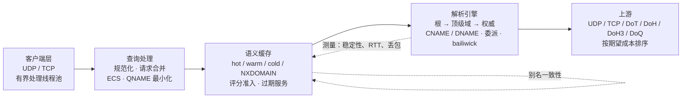
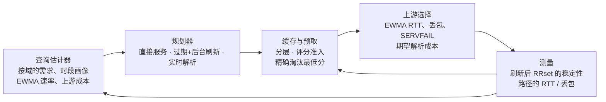

# RecurseX

*[English](README.md)*

RecurseX 是一个用 Rust 写的递归 DNS 相关解析器。它和 BIND、Unbound 一样沿委派树逐级往下问，
读过 `named.conf` 的人不会有陌生感。区别在于它**凭什么相信自己手里已有的数据**：一个已过期的
缓存条目只有在“保守概率下界 + 后果等级 + 聚合风险预算”三者同时点头时才会被拿出来用；而刷新只会
发生在**刷新真的能抬高这个下界**的地方。

缓存不是一张 `HashMap<query, answer>`，这一点是整份代码的前提。

> 设计与其论证写在 **[`paper/RecurseX-risk-constrained-refresh.md`](paper/RecurseX-risk-constrained-refresh.md)**，
> 实现层面的细节在 wiki 的[风险约束刷新](wiki/Refresh-Theory-zh.md)。



## TTL 是声明，变化率才是测量

权威服务器告诉你的是它**声称**这条记录的生存期，它不会告诉你这条记录实际上多久变一次。这是两个
不同的量。`TTL 3600` 配一条每五分钟轮换的记录，和 `TTL 3600` 配一条半年没动过的记录，占的内存
一样多，但应该被完全区别对待。

本项目早期版本用一条 EWMA「稳定性分数」去填这个差，那是错的，理由值得留着：那个分数不是概率
（所以压在它上面的阈值是随手定的），它忽略采样节奏（相隔两秒看十次与横跨十小时看十次得到同一个
数），而且它**不可能保守**（EWMA 从中性 `0.5` 出发，于是看得越少的名字反而显得越可信）。

现在换成**关于变化率的后验**，以及它上面的**单边可信下界**：

```
Pr(Y = 1 | λ, h) = 1 − e^(−λh)        观测 = 一个暴露时长 h 与一个结果 Y
Pr(Y = 0 | λ, h) = e^(−λh)            λ | 数据 ~ Gamma(α, β)，α = α₀ + Σ w·Y，β = α₀T + Σ w·h

P_LCB(fresh, Δ) = e^(−λ_hi·Δ)         λ_hi = Gamma(α, β) 上精确的 Chernoff 界
```

最后一行要读成一句话：**即使按与观测仍然相容的最坏变化率估计，这份数据在 Δ 秒后仍然正确的概率
至少是这么多。** 这才是能拿去支撑安全论证的陈述，也是每个 stale 决策唯一消费的量。

三个推论值得点名：

- **不规律的采样是被建模的，不是被平均掉的。** 似然逐次条件在各观测自己的暴露时长上，所以看得勤
  和看得懒的解析器对同一个区会得出**不同**的结论——这是对的；得出同一个无量纲数字才是错的。
- **`Y = 0` 不等于「期间什么都没发生」。** 它只意味着那次采样没看到可见差异；两次采样之间来了
  又走的变化是看不见的。所以输出必须是分布，所以模型的状态里**根本不放**「变化次数」。
- **刷新失败不是稳定的证据。** 把超时记成「没变」会让一台不可达的上游伪装成稳定的区，并且让解析器
  **网络越差越愿意用记忆里的答案**。失败只会让证据变旧，别的什么都不教给模型。

### 遗忘顺带成了抗伪造的上界

证据以时间常数 `τ`（默认一天）指数遗忘，因为 DNS 数据不平稳。这还带来第二个效应：遗忘给累积证据
加了一个**硬上限**（`b → wτ`）。于是无论刷新多少次——诚实的或被伪造的——都无法把变化率压到零，
可信区间永远不会闭合，`P_LCB` 对任何存在过的条目都严格小于 1。处在能应答我们刷新位置上的攻击者
**无法**制造「这个名字永不变化」的无限置信，因为这个模型对任何东西都不会累积无限置信。这是更新
规则的**结构性质**，不是事后补上的检查。

同一防御的另一半：只靠 ID、端口和 0x20 大小写接受下来的应答，在统计里权重是经过认证应答的一半；
由于权重同时缩放**速率与上限**，未经认证的信道无论观测多久都买不到同等的置信。

**测出来的历史永远不会改动你下发给客户端的 TTL。** 权威说 300，客户端拿到的就是 300。模型只影响
内部时序：什么时候刷新、能不能给过期数据、准入到哪一层、淘汰谁。这条界线在这个仓库里是硬规则
而不是建议。

### 价值与安全是两个问题

对 stale 最诱人的把关是「这个名字热不热」。它错，而且错在会疼的方向：热度衡量的是答案的**收益**，
对**安全**只字未提；用它把关意味着部署里最忙的区，恰恰最可能被一份已失效的副本（退役的 NS、
被吊销的密钥）应答。失效与流量相关，这正是事故的形状。

所以两个问题分开回答。**价值**（预期节省的时延）决定什么值得刷新、按什么顺序刷。**风险**决定
stale 到底能不能给：

```
R = V · (1 − P_LCB(fresh, a)) · C · κ(trust)

C  ∈ {1 (A/AAAA), 5 (CNAME), 25 (MX/SRV), 100 (NS/glue), ∞ (DNSKEY/DS/NSEC)}
κ  ∈ {1 链锚定, 2 签名验证, 5 未验证, 10 无法判定}
```

这些分级不是装饰。**同一条** A 记录作为答案数据很便宜，作为 glue 就是 `Critical`——因为它在那里
失效会毒化该区之下的每一个后续查询。而密钥材料是 `∞`：过期的存在性证明不是新鲜度问题，是**安全**
问题——它能让已吊销的密钥复活。

每一个被批准的 stale 应答都会扣减一份**风险预算**，每一次真正派生的刷新都会扣减一份**刷新预算**。
两者都是漏桶/令牌桶，所以约束由构造成立而不是平均成立，并且都导出各自的拒绝计数——因为「瓶颈是
策略」和「瓶颈是网络」需要完全相反的处置。

### 刷新只有刷在瓶颈上才有用

一个答案是若干条目的组合——CNAME、它的目标、一次委派、一个 NS 地址、一份 DNSSEC 证明——只有
**全部**正确答案才正确。因此保守下界取它们的**最小值**而不是乘积：一次权威重发布会在同一瞬间改变
CNAME 和目标，假设独立会**低估**风险。

取最小值有一个会改变调度器的推论：**刷新除最弱一环之外的任何节点，根本抬不动这个下界。** 一个
「把链上每个快要过期的成员都刷一遍」的预取器会花光全部预算，而在最弱的那一环没变时，保证的提升
正好是零。所以刷新计划按瓶颈优先排序，每个条目都会报告「刷它到底能买到什么」，让调用方在边际刷新
不再有意义时停下。

## 刷新预算花在哪里

瓶颈论证说的是该刷**哪一个**。它没有说**下一个**刷哪一个，而维护循环手里的预算是有限的 ——
`RefreshBudget` 按固定速率发令牌 —— 所以真正决定结果的是第二个问题。过去的答案是「`P_LCB` 最低
的那个」，那是一个阈值，不是一次分配。阈值能说的只有「这个也看一眼」；它看不见一次观测能**教**
多少、这个答案**值**多少、这条记录的**等级**能造成多大伤害。

这三件事系统其余部分所用的风险泛函都看得见，所以调度器用一次观测带来的**期望风险削减**来给它定价：

```text
R   = V · (1 − p) · C · κ
VoI = R(什么都不做) − E[R(观测之后)]
```

两边都在地平线上取值，期望是对一次观测可能的两种结果——数据变了、或没变——按模型自己的预测概率
`p₀ = (β / (β + age))^α` 加权。

让这个数字能被信任的是「观测后」状态的来源：克隆危险模型，调用**真实刷新路径调用的那同一个
`observe`**。不是重新推导共轭更新——那是第二个真相来源，而它的失效方式是静默的：排序依据的是一次
模型根本不会执行的更新。

由此得到三条阈值根本不具备的性质：

- **对刚看过的东西再看一眼，价值恰为零。** 一次刷新报告的是自上次观测以来的暴露量，所以确认一件
  一分钟前的事几乎不携带证据，确认一件一小时前的事携带很多。而调度器运行时两者的 `P_LCB` 可以完全
  相同。这条由 `looking_at_something_we_just_looked_at_buys_nothing` 断言。
- **价值对「赌注」单调**——对后果等级、对信任惩罚、对省下的延迟 `V`。没人等的记录，无论模型多不
  确定，都不值一枚令牌。
- **价值永不超过「不行动的风险」。** 观测只能削减风险。

每次观测花一枚令牌，所以最优分配就是取价值最大的 N 个——功夫花在**算**这些值上，不在选择上，而选择
也没有被包装成排序之外的东西。调度器在上面额外加的是**按类别的保留额度**：纯粹按价值排序会造成饥饿，
而这里的饥饿是自我强化的 —— 一个从未被观测的条目，证据会按设计衰减，于是界变宽，于是当查询真的
到来时它**不能再被 stale 服务**。保证被精确陈述，并与它所防止的饥饿并排测试：只要预算不少于
「类别数 × 保留量」，每个类别就至少贡献保留量。

预测用于**价值**，可信上界用于**安全**。这不是自相矛盾——价值就是期望，问「平均而言我们会学到什么」
完全正确；而安全决策问的是「我们错了的概率」，均值不是保证。同一条界线本来就分离了 `CacheScore`
与 `risk`。[推导、诚实的边界以及一个算出来的值在 wiki 里](wiki/Value-of-Information-zh.md)。

## 预测回路

四个环节是接起来的，不是并排放着的：



估计器只回答**价值**侧真正会问的那个问题：**这个域在未来 60 秒内被问到的概率是多少**。它由按域
维护的 96 个时段桶（每桶 15 分钟）加一个短期新鲜度项拼出来。这个概率只决定「一次后台刷新值不值得
花掉一个名额」，**从不**决定能不能给过期数据——一次缓存命中便宜，并不说明它安全。

安全那一侧是上面的风险模型与风险预算。它刻意对估计器一无所知：仓库里有一个测试的唯一目的，就是
让将来重新引入这个依赖的人必须刻意删掉它。

## 一个查询实际经历了什么

1. **服务器**：接收线程读到一个数据报就丢进有界工作队列，解析线程从队列取。队列满就丢弃该数据报
   并计数 —— 过载退化成丢包，而不会退化成无界内存或无界线程数。
2. **策略**：校验报文（opcode、恰好一个问题、标签数、禁止区传送），按客户端令牌桶限速，查黑名单。
3. **合并**：第一个询问 `(name, type, class, ECS, DO)` 的线程成为 owner 去解析，其余线程停在它的
   slot 上等同一个结果。在途表有上限（`max_inflight`），而且 owner **一定会发布结果**：解析若在
   栈回退中结束，`Owner::drop` 会发布一个错误，所以等待者不可能挂在一个永远不会被填的 slot 上。
4. **先查缓存**：请求方自己的 ECS 分区 → 覆盖它的每一级更宽 scope → 全局分区；然后是同名 CNAME
   → NXDOMAIN 存储。新鲜命中直接返回；
   已过期但还在 stale 窗口内的命中交给规划器，它要么给过期数据（并排队后台刷新），要么让查询继续。
5. **解析**：从已知最深的域开始做 QNAME 最小化、带 bailiwick 过滤的委派下钻、CNAME/DNAME 追踪，
   每一跳都用期望成本排序选上游；UDP 被截断就改走 TCP。
6. **回填缓存**：把应答拆成 RRset，带着估计器给出的流行度与成本信号算出的准入分数写入。
7. **应答**：一次序列化就把应答截断到客户端声明的 EDNS 缓冲区大小；需要丢记录时置 TC 并保留
   OPT 记录。

## 设计取舍

### 只有一份评分函数，也就只有一套淘汰规则

`cache::score::score` 是唯一计算缓存分数的地方。准入、命中时重算、淘汰排序都用同一组参数调用它，
所以条目的分层和它在淘汰顺序里的位置不可能互相矛盾：

```
score = 0.30·popularity + 0.18·locality + 0.20·durability
      + 0.16·ttl        + 0.11·cost     − 0.05·memory
```

其中 `durability` 是模型在 60 秒视界上的估计值，也是唯一有校准含义的项。整个分数是一个**价值**
函数——「什么值得留在内存里」——它**永远不是安全门**：两个条目可以分数相同，而一个是即将过期的
委派、另一个是根本没人问的 TXT 记录，这个问题换任何一组权重都修不好，因为它们的区别不是程度问题。
能不能给答案由上面的风险泛函决定。

阈值：0.72 进 hot，0.35 进 warm，0.15 进 cold，低于 0.15 根本不缓存。

淘汰是**精确**的，不是采样：每层维护一个以 `(量化分数, 键)` 为键的次级索引，取最低分是
`O(log n)`。加这个索引是有具体原因的 —— 最直观的写法（遍历整层取最小值）在缓存满之后就是每次
插入 `O(n)`，等于把"填满缓存"变成 `O(n²)`，同时也给任何能逼出淘汰的人提供了一个放大点。换层最多
付出一次淘汰加一步降级（`spill`），而降级**刻意不做递归**：级联降级会让一次插入的代价无上限。

### 别名图回答的是反向问题

缓存能告诉你某个键下面存着什么，但它没法告诉你还有谁依赖这个键 —— "依赖"不是 map 条目的属性。
在 DNS 里这个关系到处都是：只有当 `www` 的 CNAME 和目标地址数据**同时**新鲜时，解析器才能用缓存
回答 `www.example.com A`。只刷新目标、让 CNAME 一分钟后自己过期，下一个客户端查询照样要付一次
解析 —— 预取只做了一半。

`src/alias.rs` 就记这一个关系（`(owner, CNAME) → (target, type)`），并且两个方向都存。
`Resolver::refresh_with_dependents` 用的是反向，两个触发点都会调它：预测式预取，以及请求路径上的
过期命中。图有边数上限，维护任务按时间剪枝并把规模采样进统计。

这个模块更早的版本是一张通用分辨率图，带区域、NS 名和服务器地址节点。每一步解析都在写边，而没有任何
一个决策去读它。现在它被上面这个结构取代了：一个关系、一个用途、一个消费者 —— 如果一个数据结构没有
读者，那它不是设计，是成本。

### 上游选择给重传定价

按 RTT 排序选服务器是错的。一台 92% 时间很快的服务器，一旦把重传算进去，期望成本可能比一台稍慢但
从不失败的服务器更高：

```
cost = rtt_ewma + setup_rtts·rtt_ewma + RTO·p_loss/(1−p_loss) + 1.5·RTO·p_servfail
RTO  = max(rtt_ewma + 4·rtt_variance, 25 ms)
```

有两个容易写错、这里用测试钉住的细节：

- **第一次接触失败也必须记下来。** `record_timeout` 和 `record_servfail` 在路径模型不存在时会先建
  模型。想当然的写法（只更新已知路径）会让一台黑洞服务器永远停在乐观先验上，于是每次查询都先拨它。
- **没有测量数据的路径按"它可能达到的最好情况"排序**，而不是按悲观猜测：未知路径排在已测路径前面，
  得到恰好一次探测机会，之后由它自己的测量结果说话。

### 冗余的服务器集合，要当成一个集合来用

按成本排序是对的，但还不够。机群里每台解析器持有同一份委派、从同一批测量里算出同一批成本，于是
收敛到**同一台**服务器上——并且会一直待在那儿，因为它随后做的测量会确认这个选择。一个有五台等价
服务器的委派，就这样被当成一台机器来用。

所以：成本落在容差带内的候选进入一轮**带密钥的会合抽签**；带外的候选保持精确的成本顺序。带内的
服务器按构造在测量分辨率上不可区分，由下式选出一台：

```
score_i = −ln(U_i) / w_i ,   U_i 由带密钥哈希给出，均匀分布于 (0,1]
```

这就是"指数竞速"：`i` 胜出的概率**恰好**是 `w_i / Σ w_j`；而撤掉一个候选，**只**改变它原本赢下的
那些问题。第二条在测试里是按**相等**断言的，不是落在容差内——`hash % n` 那种构造会彻底失败，所以
这里没有用它。

排序的头部是 128 位启动密钥与"问题"的一个纯函数，所以持有同一密钥的每台解析器都会给出同样的结果，
而能看见查询的观察者算不出我们将要联络哪台权威。这一点很重要：能算出下一跳的攻击者，恰恰知道该把
欺骗尝试预先架在哪条路径上。

`engine.affinityBandPct` 与 `engine.affinityBandMs` 设定带宽；**两者都**设为 `0` 会把它压缩到只剩
最便宜的那一个，从而关闭抽签。`stats.affinityLotteries`
统计它实际运行了多少次——于是"带宽只放进过一台服务器"是可观测的，而不是与"功能没开"无法区分。

### 刷新顺序是带密钥的，不是按字母表

维护循环的预算有限，所以条目**消耗预算的顺序**决定了谁会被看一眼。第一个排序键是固定的、不是可选项：
`P_LCB(fresh, horizon)` 升序，置信度最差的优先。以前并列项按名字打破——那是查询流的一个公开函数，
因此同时是两个缺陷。机群里持有同一批条目的每台解析器都以同样的顺序刷新同样的名字（对权威而言是
一次机群级的人群冲锋）；而能看见查询的观察者就知道我们下一个会去看哪个条目，那正是伪造答案最有机会
进入模型的时间。

现在并列项由**带密钥的行为指纹**打破：实测的变化上界、TTL、TTL 波动、信任等级与解析成本，按"每次
翻倍一个桶"量化——足够粗糙，模型漂移时类别不会抖动；再在一个密钥下做标签。`Debug` 会遮蔽密钥，
也没有任何访问器返回它，因为那种访问器在现实里的唯一归宿就是日志。

这就是"行为哈希"能够成立的诚实那一半。它不是地址，不能路由封包：发送方算出的哈希无法选出目的地，
因为目的地的行为在发送方那里是未知的；而按哈希距离转发，仍然需要为哈希空间里的每个区域准备下一跳
——那就是路由表。[这套提案里哪部分经得起物理的检验，wiki 里逐条写清了](wiki/Beyond-The-Lookup-zh.md)，
包括经不起的那部分。

`engine.decorrelateRefresh`（默认 `true`）是给"没有密钥可持有的部署"（比如密闭回放台）留的出口。
关掉它会退回名字序，而 `stats.refreshUndecorrelated` 会统计有多少轮是那样跑的——于是"处于相关顺序"
是一个读数，而不是一次意外。这个开关存在的原因是：没有它，那个计数器就是不可达的死代码。

### 边界，以及每条边界各自防的是什么

| 表 | 默认上限 | 防的是什么 |
| --- | --- | --- |
| 缓存 hot / warm / cold | 2 048 / 131 072 / 32 768 条 | 工作集，不是泄漏 |
| NXDOMAIN 存储 | 65 536 个名字 | 最廉价的一条：任何随机名字都能造出来 |
| 估计器跟踪的域 | 100 000 个 apex | 随机子域洪水 |
| 上游路径 | 4 096 个端点 | 恶意委派给的 NS 集洪水 |
| 客户端令牌桶 | 65 536 个客户端 | 伪造源地址的洪水（见下面那段实话） |
| 在途查询 | 4 096 个键 | 合并表 |
| 并发后台刷新 | 8 个线程 | 过期命中会从请求路径排队刷新 |
| 别名边 | 100 000 条 | CNAME 链 |
| 单报文段数 | 每段 4 096 条记录、16 个问题 | 解析代价与报文长度成正比 |
| 名字 | 255 字节、127 个标签、128 跳指针 | 线格式；有证明说明 128 跳不会误拒合法名字 |
| UDP 应答 | 客户端声明的 EDNS 大小，下限 512 | 不发超大包，也不做反射放大 |

填满任何一张表的均摊代价都是每次插入 `O(1)`（`src/bounded.rs`）：先是几乎零成本的老化条目清扫，
只有整张表都是**活跃**条目时才会触发按步长删除。唯一不做的事，就是在插入路径上扫自己。

### 线格式解析不信任任何输入

- 段计数在任何循环开始前就有上限，每个长度字段都对报文缓冲区做校验。
- 压缩指针必须严格向后移动，跳数预算由 255 字节的名字上限推出来（每跳至少贡献两个字节），因此它既
  能拒绝所有指针环，又不会拒绝任何线格式允许的名字。
- 只有在偏移小于 0x4000 时才发出压缩指针 —— 14 位是指针字段的硬限制，超过这个长度的 TCP 大应答会
  停止压缩，而不是写出一个被截断的指针。
- 重新编码后 RDATA 放不进 16 位长度字段的记录会被报错。悄悄截断长度等于把一个损坏的报文交给客户端，
  那比 SERVFAIL 更糟。

### 一个职能只有一份实现

下面这些地方是有意只存在一份的，代码里也这么写着：

- 评分函数（不是准入一份、淘汰另一份）；
- 合并表（没有第二份专门数等待者）；
- 别名图（通用图是被删掉的，不是留着不读）；
- 刷新路径（两个触发点都走 `refresh_with_dependents`）；
- 容量清扫（`src/bounded.rs` 被四张表复用）；
- DNSSEC 验签例程（链上走查调用的就是 `validate_rrset`）。

## 这里不做什么

直说，因为不说清楚就等于让 README 暗示比代码更多的东西：

- **DNSSEC 算法**：RSASHA256（8）是从零实现并完整验证的。基于 SHA-1 的算法（5/7）作为已废弃算法
  直接拒绝。ECDSA（13/14）与 EdDSA（15/16）在本构建里只是被识别、没有验签 —— 只用这些算法的区
  给出的判定是 `Indeterminate`，不会伪造一个 "secure"。
- **DNSSEC 范围**：`Secure` 的含义是"这条数据上的 RRSIG 用某个 DNSKEY 验过了，且该 DNSKEY 与父区
  里 signer 的 DS 记录匹配"。DNSKEY 与 DS 的查询走的是和其他查询同样的加固路径，但本构建**不内置
  根信任锚**，也不验证 DS RRset 自己的签名；嵌套查询为了限制递归深度会刻意跳过验证。没有 NSEC/NSEC3
  证明，所以否定应答不做认证。需要锚定到 IANA 根的完整链，目前不在这个仓库里。
- **DoQ**：QUIC v1（RFC 9000/9001/9002）与 DoQ 帧（RFC 9250）在本仓库内实现，建立在 courierust
  公开的包/CRYPTO 编解码、X25519、HKDF 与验签之上。握手在环回下与 courierust 的 H3 服务器可以完整
  走通。我们测过的两台公共 DoQ 解析器会把整个握手飞行放进一个大于 1500 字节的数据报里，而到它们的
  路径在我们网络下对 1400 字节 UDP 包的丢包率是 50–66%，因此从本机无法与它们完成握手 —— 这是路径
  MTU 的观测，不是对代码的辩解。
- **服务端**：面向客户端的服务器只说普通 UDP 和 TCP。DoT/DoH/DoH3/DoQ 是上游传输；没有
  DNS-over-HTTPS 服务端。
- **时间**：`tzcraft` 不带 IANA 时区库，所以估计器的时段画像是 UTC 墙钟时间。
- **持久化缓存**：`persist` 特性按间隔原子地写整份快照，写入不是增量的。
- **传输层套接字**：上游 UDP 每次交换开一个套接字，TCP 每次交换建一条连接。这样天然得到每查询的源端口
  随机化；它不是连接池设计，而如果要往单核每秒几万查询推，连接池显然是下一步。
- **限速按源 IP 计**，因此它天生是尽力而为：伪造源地址的洪水每个包都会拿到一个新桶。能保证的是
  **上限** —— 桶表封顶，而且淘汰一个闲置桶是零代价的（它本来也会补满），所以洪水付出的是有界的内存
  和 CPU，而不是每包无界的工作量。
- **亲和抽签分散的是「我们」的负载，不是互联网的。** 它消除的是机群收敛到同一台权威这一真实且常见
  的缺陷。它**不**缓解针对权威的流量型攻击，也**不**改客户端收到的任何一个字节：选择发生在我们与
  我们询问的那台服务器之间。答案里的记录、顺序无关性（RFC 2181 §5.1）与 TTL 都是那个区的。
- **行为指纹不是地址。** 它不在线上，不能路由任何东西；发送方算出的哈希无法选出目的地。
  [「无服务器行为哈希网络」提案里哪部分物理上可行、哪部分不可行，wiki 里逐条写清了](wiki/Beyond-The-Lookup-zh.md)，
  而不是悄悄略过。

## 构建

需要 Rust 1.78 或更新（CI 矩阵同时跑 MSRV 和 stable）：

```sh
cargo build --release                       # 默认特性，全功能
cargo build --no-default-features           # no_std + alloc 的算法核心
cargo test --all-features                   # 455 个测试 + 4 个文档测试
cargo run --example quick_check             # 在线解析，需要网络
```

默认特性为 `std`、`dot`、`doh`、`doh3`、`doq`、`dnssec`、`persist`。算法核心（线格式编解码、
缓存、估计器、别名图、上游模型、规划器、稳定性）不带 `std` 也能编译；联网解析器、服务器、配置与
传输都由 `std` 门控。

## 用法

```rust
use recurse_x::{Name, RrType, Resolver, ResolverConfig};

let resolver = Resolver::new(ResolverConfig::default());
let name = Name::from_ascii("ietf.org").unwrap();
match resolver.resolve(&name, RrType::A) {
    Ok(res) => {
        // res.answers, res.ttl, res.validated, res.from_cache, res.stale
        for r in &res.answers {
            println!("{} {:?}", r.name, r.rdata);
        }
    }
    Err(e) => eprintln!("resolution failed: {e}"),
}
```

面向客户端的服务器就是再加两行：

```rust
use recurse_x::{Resolver, ResolverConfig, Server};

let server = Server::new(Resolver::new(ResolverConfig::default()));
let addr = server.bind_udp("127.0.0.1:5353".parse().unwrap())?;
server.bind_tcp("127.0.0.1:5353".parse().unwrap())?;
// dig @127.0.0.1 -p 5353 example.com A
```

服务器与解析器起的每一个循环都是可停的：`shutdown()` 只置一个标志，UDP 接收循环、处理线程、
TCP accept、每连接的读取循环和维护循环都会轮询它，因此 `join()` 会真的返回，而不是把线程留在
再也不会有人说话的套接字上：

```rust
server.shutdown();
resolver.shutdown();
server.join();               // 所有循环退出后返回
```

这正是进程退出能干净收尾的原因：一个本来要睡一分钟的维护线程会在 100 ms 内停下，并且在开启
`persist` 时顺手写下最后一份缓存快照。

后台维护（缓存清扫、别名剪枝、预测式预取）需要你显式起一个线程：

```rust
let _handle = resolver.spawn_maintenance();
```

### 配置

整个解析器可以用一份 JSON 文档配置。每个字段都可选，缺失时回落到解析器默认值而不是零 ——
一份极简文档不可能顺手关掉 QNAME 最小化、把超时归零或把缓存清空：

```json
{
  "listen": [{ "addr": "0.0.0.0:53", "proto": "udp" }],
  "cache": { "hotCapacity": 2048, "warmCapacity": 131072, "nxCapacity": 65536 },
  "engine": {
    "qnameMinimization": true,
    "use0x20": true,
    "dnssec": true,
    "rootServers": ["127.0.0.1:5353"],
    "forwarders": [
      { "proto": "dot", "ip": "1.1.1.1", "port": 853, "host": "cloudflare-dns.com" }
    ]
  },
  "persist": { "path": "/var/lib/recursex/cache.rxc", "saveIntervalMs": 60000 }
}
```

`rootServers` 接受 `ip` 或 `ip:port`，所以本地 unbound/knot（或测试桩）可以充当树的入口。转发器
按顺序尝试直到有一个返回 ID 与问题都匹配的应答。配了任何转发器，解析器就进入转发模式：转发器够
不着会**直接报错**，而不会悄悄变成一次完整迭代解析 —— 因为两者对"谁看得见这条查询"的答案不同，
转发到过滤型解析器的部署不该被绕过。加密转发器必须写 `host`（用于 SNI 与证书校验的身份），文档
里漏写会在加载时被拒绝，而不是以"没有身份"的状态运行。需要真实验证时用
`Resolver::set_forwarder_roots` 装上信任锚。

### 示例

| 示例 | 演示内容 |
| --- | --- |
| `quick_check` | 在线端到端解析，以及第二遍从缓存命中 |
| `multi_type_resolve` | 一个名字的 A / AAAA / MX / TXT / NS / SOA |
| `server_demo` | 本地 UDP+TCP 服务器与 JSON 配置 |
| `custom_config` | 纯代码构建的严格配置解析器 |
| `forward_resolver` | 走 DoT 与普通 UDP 的转发 |
| `persist_cache` | L3 快照：热缓存重启后仍在 |

```sh
cargo run --example multi_type_resolve
cargo run --example server_demo      # 阻塞运行；用 dig -p 5353 查询
```

## 仓库导览

| 路径 | 里面是什么 |
| --- | --- |
| `src/name.rs`、`src/message.rs`、`src/rdata.rs`、`src/edns.rs` | 线格式：名字、压缩、报文、全部 RR 类型、EDNS(0) |
| `src/cache/` | 分层缓存、准入评分、L3 快照（`persist`） |
| `src/hazard.rs`、`src/risk.rs`、`src/provenance.rs`、`src/planner.rs` | 决策的那一半：变化率后验与可信界、风险泛函与预算、依赖集合、规划器 |
| `src/voi.rs` | 分配的那一半：一次额外观测在风险单位下值多少，以及有限刷新预算该花在哪些条目上 |
| `src/budget.rs`、`src/calibration.rs` | 每次解析的工作信封（NXNS 门）、校准面（Brier / log loss / 可靠性表 / 时延分位） |
| `src/estimator.rs`、`src/stability.rs`、`src/cache/score.rs` | 价值的那一半：需求估计、逐条目刷新模型的门面、准入排序 |
| `src/behavior.rs`、`src/rendezvous.rs` | 带密钥的行为身份（刷新顺序去相关）与带权会合选择（上游亲和） |
| `src/alias.rs` | 缓存答案之间的别名依赖 |
| `src/upstream.rs`、`src/transport.rs`、`src/transports/` | 路径模型及其背后的传输 |
| `src/resolver.rs` | 解析主循环、请求合并、维护任务 |
| `src/server.rs` | 面向客户端的 UDP/TCP 服务器 |
| `src/policy.rs`、`src/entropy.rs`、`src/prng.rs` | 限速、OS 熵、PRNG 与 SipHash 原语 |
| `src/bounded.rs`、`src/float.rs` | 容量清扫；MSRV 需要的 `no_std` 浮点辅助 |
| `tests/` | 面向公开 API 的集成测试，以及解析器的对手 |
| `wiki/` | 更长的设计笔记，包括 [PARR 回路](wiki/PARR-zh.md) |

## 测试与 CI

目前是 431 个单元测试、`tests/` 下 24 个集成测试、4 个文档测试（默认配置下共 459 个），套件
**不对公网的任何应答做断言**：测试里的上游是本地桩服务器，所以 `cargo test` 的自洽性意味着它的
结果说的是解析器，而不是网络。覆盖范围包括线格式编解码（含各种拒绝路径）、缓存准入/淘汰/过期服务与 **ECS 分区**、持久化、
危险模型（变化率后验与 Chernoff 上界，含一个「测试造不出伪造证据」的性质）、风险预算与过度服务
台账、每次解析的工作信封（含 NXNS 门）、答案依赖 DAG 与剪枝保值引理、校准（Brier / log loss /
可靠性表）、估计器里 `exp` 实现与参考值的比对、规划器决策、别名图的两个方向与剪枝、上游成本选路、
合并器（含 owner 消失却不发布的场景）、UDP 按声明大小截断、服务器端到端 UDP/TCP 路径、DNSSEC
RSA 验签（用 openssl 真实生成的测试向量）与四态信任阶梯、以及浮点辅助的自检。

集成测试写的是嵌入者关心的东西：从 JSON 文档搭出解析器、用 UDP **和** TCP 提供服务、断言第二次
查询由缓存回答且不再碰上游、从 `persist` 快照“重启”进程、并通过公开的关闭 API 停掉全部东西。
`tests/iterative_path.rs` 让一个桩根与桩 `test` 区走完委派、NXDOMAIN、REFUSED 与黑洞，被钉住的
是**解析规则**而不是编解码。`tests/wire_robustness.rs` 给解码器灌 20000 个确定性伪随机缓冲区，再
加上恶意的计数字段、压缩指针成环、以及每一个截断边界，断言解析器绝不 panic，且凡是它接受的输入
都能重编码/重解析后完全一致。

CI 在 MSRV（1.78）与 stable 两条工具链、Linux 与 Windows 两个平台上跑：

- `fmt` —— `cargo fmt --all -- --check`。
- `clippy` —— 全特性全目标、`no_std` 核心、以及不带传输的 `std`，三者都 `-D warnings`。
- `doc` —— `RUSTDOCFLAGS=-D warnings` 的 `cargo doc`，加上全特性与无特性的文档测试。
- `test` —— 全特性、默认特性、以及 release 模式（发行用的就是 release profile：fat LTO、单个
  codegen unit）各跑一遍套件。
- `features` —— `no_std` 核心、单独 `std`、每个可选特性单独、以及全开，逐个构建。
- `release` —— release 构建，以及 release 与 `no_std` 两种配置下的 examples。
- `package` —— `cargo package`，保证将要发布的 tarball 自己能构建。

每个任务里所有 warning 都是 error：`RUSTFLAGS=-D warnings` 只作用于本 crate，依赖的 lint 被 Cargo
封顶，所以依赖那边多出一个 warning 不会把构建搞红。

## 安全说明

- **防欺骗是分层的**：事务 ID 来自 OS 熵播种的 SplitMix64 且每 4096 次重播种，0x20 QNAME 大小写
  随机化默认开启，应答要同时匹配 ID 与回显的问题，UDP 用未连接套接字（来源不对的应答直接忽略），
  再加上决定"哪些数据可以入缓存"的 bailiwick 规则。
- **反射**：UDP 服务器绝不会发出超过客户端声明 EDNS 缓冲区的数据报，也不会给出比客户端所问更多的
  数据。
- **输入处理**：解析器在产生可观分配之前就拒绝畸形报文；任何恶意查询流能碰到的表都有上限（见上面的
  边界表）。
- **诚实的边界**：按客户端限速以源地址为键，因此可以被伪造绕过；DNSSEC 的判定受上面写的算法支持与
  信任模型限制；`persist` 快照只做结构校验，不做认证。

## License

版权所有 2026 blueokanna。RecurseX 采用
[PolyForm Shield License 1.0.0](LICENSE)。它是 source-available 协议：
禁止使用本软件提供与 RecurseX、或许可方使用 RecurseX 提供的产品相竞争的产品。标准
PolyForm Shield 条款**并不**全面禁止非竞争性商业销售或订阅。
