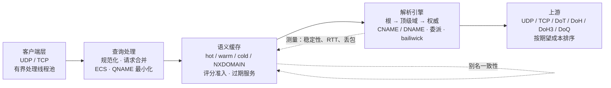
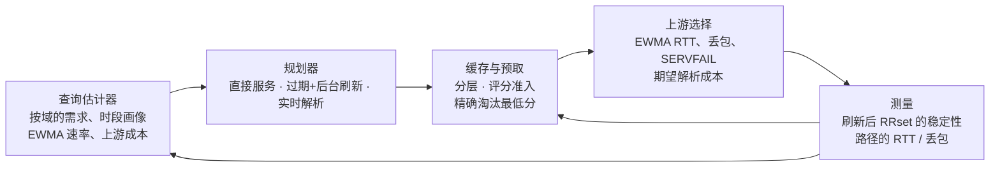

# RecurseX

*[English](README.md)*

RecurseX 是一个用 Rust 写的递归 DNS 解析器。它和 BIND、Unbound 一样沿委派树逐级往下问，
读过 `named.conf` 的人不会有陌生感。区别在于它**怎么用已经看到的数据**：每条缓存条目都带着
自己被测出来的历史，所有缓存决策都出自同一个评分函数，而解析器里每一张可能被攻击者撑大的表
都有一个明确的上限。

缓存不是一张 `HashMap<query, answer>`，这一点是整份代码的前提。



## TTL 是声明，稳定性是测量

权威服务器告诉你的是它**声称**这条记录的生存期，它不会告诉你这条记录实际上多久变一次。这是两个
不同的量。`TTL 3600` 配一条每五分钟轮换的记录，和 `TTL 3600` 配一条半年没动过的记录，占的内存
一样多，但应该被完全区别对待：

- 爱变的那条：过期后不值得信任，应该提前、频繁地刷新，也不该占着热点位置；
- 稳定的那条：可以在后台按计划悄悄刷新，刷新期间对外提供过期数据也没人察觉。

RecurseX 测的就是第二个量。每条缓存条目持有自己的 `StabilityModel`：采样次数、变更次数、EWMA
稳定性、长期变更比例、权威 TTL 及其波动性的 EWMA，以及连续刷新失败次数。刷新时按**内容**比较新旧
RRset（不含 TTL —— 只有 TTL 变了不算数据变化），这个比较结果才会推动模型。

**测出来的历史永远不会改动你下发给客户端的 TTL。** 权威说 300，客户端拿到的就是 300。稳定性只
影响内部时序：什么时候预取、要不要给过期数据、准入到哪一层、淘汰谁。这条界线在这个仓库里是硬规则
而不是建议 —— `stability.rs`、`planner.rs`、`cache/score.rs` 里没有任何一行能写 TTL。

## 预测回路

四个环节是接起来的，不是并排放着的：



估计器只回答规划器真正会问的那个问题：**这个域在未来 60 秒内被问到的概率是多少**。它由两部分
拼出来：按域维护的 96 个时段桶（每桶 15 分钟）加一个短期新鲜度项；前者做泊松需求估计，后者取
EWMA 到达间隔速率，两者取大。要给过期数据，需要概率 ≥ 0.5 **并且**该条目已成熟且足够稳定，
其余情况一律实时解析。这就是全部的"预测"——一个概率和一个稳定性分数，两者都由观测重算，且都允许
回答"我不知道"。

## 一个查询实际经历了什么

1. **服务器**：接收线程读到一个数据报就丢进有界工作队列，解析线程从队列取。队列满就丢弃该数据报
   并计数 —— 过载退化成丢包，而不会退化成无界内存或无界线程数。
2. **策略**：校验报文（opcode、恰好一个问题、标签数、禁止区传送），按客户端令牌桶限速，查黑名单。
3. **合并**：第一个询问 `(name, type, class, ECS, DO)` 的线程成为 owner 去解析，其余线程停在它的
   slot 上等同一个结果。在途表有上限（`max_inflight`），而且 owner **一定会发布结果**：解析若在
   栈回退中结束，`Owner::drop` 会发布一个错误，所以等待者不可能挂在一个永远不会被填的 slot 上。
4. **先查缓存**：精确键 → 去掉 ECS 的键 → 同名的 CNAME → NXDOMAIN 存储。新鲜命中直接返回；
   已过期但还在 stale 窗口内的命中交给规划器，它要么给过期数据（并排队后台刷新），要么让查询继续。
5. **解析**：从已知最深的域开始做 QNAME 最小化、带 bailiwick 过滤的委派下钻、CNAME/DNAME 追踪，
   每一跳都用期望成本排序选上游；UDP 被截断就改走 TCP。
6. **回填缓存**：把应答拆成 RRset，带着估计器给出的流行度与成本信号算出的准入分数写入。
7. **应答**：一次序列化就把应答截断到客户端声明的 EDNS 缓冲区大小；需要丢记录时置 TC 并保留
   OPT 记录。

## 设计取舍

### 只有一份评分函数，也就只有一套淘汰规则

`cache::score::score` 是唯一计算缓存分数的地方。准入、命中时重算、淘汰排序都用同一组参数调用它，
所以条目的分层和它在淘汰顺序里的位置不可能互相矛盾：

```
score = 0.30·popularity + 0.18·locality + 0.20·stability
      + 0.16·ttl        + 0.11·cost     − 0.05·memory
```

阈值：0.72 进 hot，0.35 进 warm，0.15 进 cold，低于 0.15 根本不缓存。

淘汰是**精确**的，不是采样：每层维护一个以 `(量化分数, 键)` 为键的次级索引，取最低分是
`O(log n)`。加这个索引是有具体原因的 —— 最直观的写法（遍历整层取最小值）在缓存满之后就是每次
插入 `O(n)`，等于把"填满缓存"变成 `O(n²)`，同时也给任何能逼出淘汰的人提供了一个放大点。换层最多
付出一次淘汰加一步降级（`spill`），而降级**刻意不做递归**：级联降级会让一次插入的代价无上限。

### 别名图回答的是反向问题

缓存能告诉你某个键下面存着什么，但它没法告诉你还有谁依赖这个键 —— "依赖"不是 map 条目的属性。
在 DNS 里这个关系到处都是：只有当 `www` 的 CNAME 和目标地址数据**同时**新鲜时，解析器才能用缓存
回答 `www.example.com A`。只刷新目标、让 CNAME 一分钟后自己过期，下一个客户端查询照样要付一次
解析 —— 预取只做了一半。

`src/alias.rs` 就记这一个关系（`(owner, CNAME) → (target, type)`），并且两个方向都存。
`Resolver::refresh_with_dependents` 用的是反向，两个触发点都会调它：预测式预取，以及请求路径上的
过期命中。图有边数上限，维护任务按时间剪枝并把规模采样进统计。

这个模块更早的版本是一张通用分辨率图，带区域、NS 名和服务器地址节点。每一步解析都在写边，而没有任何
一个决策去读它。现在它被上面这个结构取代了：一个关系、一个用途、一个消费者 —— 如果一个数据结构没有
读者，那它不是设计，是成本。

### 上游选择给重传定价

按 RTT 排序选服务器是错的。一台 92% 时间很快的服务器，一旦把重传算进去，期望成本可能比一台稍慢但
从不失败的服务器更高：

```
cost = rtt_ewma + setup_rtts·rtt_ewma + RTO·p_loss/(1−p_loss) + 1.5·RTO·p_servfail
RTO  = max(rtt_ewma + 4·rtt_variance, 25 ms)
```

有两个容易写错、这里用测试钉住的细节：

- **第一次接触失败也必须记下来。** `record_timeout` 和 `record_servfail` 在路径模型不存在时会先建
  模型。想当然的写法（只更新已知路径）会让一台黑洞服务器永远停在乐观先验上，于是每次查询都先拨它。
- **没有测量数据的路径按"它可能达到的最好情况"排序**，而不是按悲观猜测：未知路径排在已测路径前面，
  得到恰好一次探测机会，之后由它自己的测量结果说话。

### 边界，以及每条边界各自防的是什么

| 表 | 默认上限 | 防的是什么 |
| --- | --- | --- |
| 缓存 hot / warm / cold | 2 048 / 131 072 / 32 768 条 | 工作集，不是泄漏 |
| NXDOMAIN 存储 | 65 536 个名字 | 最廉价的一条：任何随机名字都能造出来 |
| 估计器跟踪的域 | 100 000 个 apex | 随机子域洪水 |
| 上游路径 | 4 096 个端点 | 恶意委派给的 NS 集洪水 |
| 客户端令牌桶 | 65 536 个客户端 | 伪造源地址的洪水（见下面那段实话） |
| 在途查询 | 4 096 个键 | 合并表 |
| 并发后台刷新 | 8 个线程 | 过期命中会从请求路径排队刷新 |
| 别名边 | 100 000 条 | CNAME 链 |
| 单报文段数 | 每段 4 096 条记录、16 个问题 | 解析代价与报文长度成正比 |
| 名字 | 255 字节、127 个标签、128 跳指针 | 线格式；有证明说明 128 跳不会误拒合法名字 |
| UDP 应答 | 客户端声明的 EDNS 大小，下限 512 | 不发超大包，也不做反射放大 |

填满任何一张表的均摊代价都是每次插入 `O(1)`（`src/bounded.rs`）：先是几乎零成本的老化条目清扫，
只有整张表都是**活跃**条目时才会触发按步长删除。唯一不做的事，就是在插入路径上扫自己。

### 线格式解析不信任任何输入

- 段计数在任何循环开始前就有上限，每个长度字段都对报文缓冲区做校验。
- 压缩指针必须严格向后移动，跳数预算由 255 字节的名字上限推出来（每跳至少贡献两个字节），因此它既
  能拒绝所有指针环，又不会拒绝任何线格式允许的名字。
- 只有在偏移小于 0x4000 时才发出压缩指针 —— 14 位是指针字段的硬限制，超过这个长度的 TCP 大应答会
  停止压缩，而不是写出一个被截断的指针。
- 重新编码后 RDATA 放不进 16 位长度字段的记录会被报错。悄悄截断长度等于把一个损坏的报文交给客户端，
  那比 SERVFAIL 更糟。

### 一个职能只有一份实现

下面这些地方是有意只存在一份的，代码里也这么写着：

- 评分函数（不是准入一份、淘汰另一份）；
- 合并表（没有第二份专门数等待者）；
- 别名图（通用图是被删掉的，不是留着不读）；
- 刷新路径（两个触发点都走 `refresh_with_dependents`）；
- 容量清扫（`src/bounded.rs` 被四张表复用）；
- DNSSEC 验签例程（链上走查调用的就是 `validate_rrset`）。

## 这里不做什么

直说，因为不说清楚就等于让 README 暗示比代码更多的东西：

- **DNSSEC 算法**：RSASHA256（8）是从零实现并完整验证的。基于 SHA-1 的算法（5/7）作为已废弃算法
  直接拒绝。ECDSA（13/14）与 EdDSA（15/16）在本构建里只是被识别、没有验签 —— 只用这些算法的区
  给出的判定是 `Indeterminate`，不会伪造一个 "secure"。
- **DNSSEC 范围**：`Secure` 的含义是"这条数据上的 RRSIG 用某个 DNSKEY 验过了，且该 DNSKEY 与父区
  里 signer 的 DS 记录匹配"。DNSKEY 与 DS 的查询走的是和其他查询同样的加固路径，但本构建**不内置
  根信任锚**，也不验证 DS RRset 自己的签名；嵌套查询为了限制递归深度会刻意跳过验证。没有 NSEC/NSEC3
  证明，所以否定应答不做认证。需要锚定到 IANA 根的完整链，目前不在这个仓库里。
- **DoQ**：QUIC v1（RFC 9000/9001/9002）与 DoQ 帧（RFC 9250）在本仓库内实现，建立在 courierust
  公开的包/CRYPTO 编解码、X25519、HKDF 与验签之上。握手在环回下与 courierust 的 H3 服务器可以完整
  走通。我们测过的两台公共 DoQ 解析器会把整个握手飞行放进一个大于 1500 字节的数据报里，而到它们的
  路径在我们网络下对 1400 字节 UDP 包的丢包率是 50–66%，因此从本机无法与它们完成握手 —— 这是路径
  MTU 的观测，不是对代码的辩解。
- **服务端**：面向客户端的服务器只说普通 UDP 和 TCP。DoT/DoH/DoH3/DoQ 是上游传输；没有
  DNS-over-HTTPS 服务端。
- **时间**：`tzcraft` 不带 IANA 时区库，所以估计器的时段画像是 UTC 墙钟时间。
- **持久化缓存**：`persist` 特性按间隔原子地写整份快照，写入不是增量的。
- **传输层套接字**：上游 UDP 每次交换开一个套接字，TCP 每次交换建一条连接。这样天然得到每查询的源端口
  随机化；它不是连接池设计，而如果要往单核每秒几万查询推，连接池显然是下一步。
- **限速按源 IP 计**，因此它天生是尽力而为：伪造源地址的洪水每个包都会拿到一个新桶。能保证的是
  **上限** —— 桶表封顶，而且淘汰一个闲置桶是零代价的（它本来也会补满），所以洪水付出的是有界的内存
  和 CPU，而不是每包无界的工作量。

## 构建

需要 Rust 1.78 或更新（CI 矩阵同时跑 MSRV 和 stable）：

```sh
cargo build --release                       # 默认特性，全功能
cargo build --no-default-features           # no_std + alloc 的算法核心
cargo test --all-features                   # 166 个测试 + 4 个文档测试
cargo run --example quick_check             # 在线解析，需要网络
```

默认特性为 `std`、`dot`、`doh`、`doh3`、`doq`、`dnssec`、`persist`。算法核心（线格式编解码、
缓存、估计器、别名图、上游模型、规划器、稳定性）不带 `std` 也能编译；联网解析器、服务器、配置与
传输都由 `std` 门控。

## 用法

```rust
use recurse_x::{Name, RrType, Resolver, ResolverConfig};

let resolver = Resolver::new(ResolverConfig::default());
let name = Name::from_ascii("ietf.org").unwrap();
match resolver.resolve(&name, RrType::A) {
    Ok(res) => {
        // res.answers, res.ttl, res.validated, res.from_cache, res.stale
        for r in &res.answers {
            println!("{} {:?}", r.name, r.rdata);
        }
    }
    Err(e) => eprintln!("resolution failed: {e}"),
}
```

面向客户端的服务器就是再加两行：

```rust
use recurse_x::{Resolver, ResolverConfig, Server};

let server = Server::new(Resolver::new(ResolverConfig::default()));
let addr = server.bind_udp("127.0.0.1:5353".parse().unwrap())?;
server.bind_tcp("127.0.0.1:5353".parse().unwrap())?;
// dig @127.0.0.1 -p 5353 example.com A
```

服务器与解析器起的每一个循环都是可停的：`shutdown()` 只置一个标志，UDP 接收循环、处理线程、
TCP accept、每连接的读取循环和维护循环都会轮询它，因此 `join()` 会真的返回，而不是把线程留在
再也不会有人说话的套接字上：

```rust
server.shutdown();
resolver.shutdown();
server.join();               // 所有循环退出后返回
```

这正是进程退出能干净收尾的原因：一个本来要睡一分钟的维护线程会在 100 ms 内停下，并且在开启
`persist` 时顺手写下最后一份缓存快照。

后台维护（缓存清扫、别名剪枝、预测式预取）需要你显式起一个线程：

```rust
let _handle = resolver.spawn_maintenance();
```

### 配置

整个解析器可以用一份 JSON 文档配置。每个字段都可选，缺失时回落到解析器默认值而不是零 ——
一份极简文档不可能顺手关掉 QNAME 最小化、把超时归零或把缓存清空：

```json
{
  "listen": [{ "addr": "0.0.0.0:53", "proto": "udp" }],
  "cache": { "hotCapacity": 2048, "warmCapacity": 131072, "nxCapacity": 65536 },
  "engine": {
    "qnameMinimization": true,
    "use0x20": true,
    "dnssec": true,
    "rootServers": ["127.0.0.1:5353"],
    "forwarders": [
      { "proto": "dot", "ip": "1.1.1.1", "port": 853, "host": "cloudflare-dns.com" }
    ]
  },
  "persist": { "path": "/var/lib/recursex/cache.rxc", "saveIntervalMs": 60000 }
}
```

`rootServers` 接受 `ip` 或 `ip:port`，所以本地 unbound/knot（或测试桩）可以充当树的入口。转发器
按顺序尝试直到有一个返回 ID 与问题都匹配的应答。配了任何转发器，解析器就进入转发模式：转发器够
不着会**直接报错**，而不会悄悄变成一次完整迭代解析 —— 因为两者对"谁看得见这条查询"的答案不同，
转发到过滤型解析器的部署不该被绕过。加密转发器必须写 `host`（用于 SNI 与证书校验的身份），文档
里漏写会在加载时被拒绝，而不是以"没有身份"的状态运行。需要真实验证时用
`Resolver::set_forwarder_roots` 装上信任锚。

### 示例

| 示例 | 演示内容 |
| --- | --- |
| `quick_check` | 在线端到端解析，以及第二遍从缓存命中 |
| `multi_type_resolve` | 一个名字的 A / AAAA / MX / TXT / NS / SOA |
| `server_demo` | 本地 UDP+TCP 服务器与 JSON 配置 |
| `custom_config` | 纯代码构建的严格配置解析器 |
| `forward_resolver` | 走 DoT 与普通 UDP 的转发 |
| `persist_cache` | L3 快照：热缓存重启后仍在 |

```sh
cargo run --example multi_type_resolve
cargo run --example server_demo      # 阻塞运行；用 dig -p 5353 查询
```

## 仓库导览

| 路径 | 里面是什么 |
| --- | --- |
| `src/name.rs`、`src/message.rs`、`src/rdata.rs`、`src/edns.rs` | 线格式：名字、压缩、报文、全部 RR 类型、EDNS(0) |
| `src/cache/` | 分层缓存、准入评分、L3 快照（`persist`） |
| `src/estimator.rs`、`src/planner.rs`、`src/stability.rs` | 预测的那一半：需求、决策、被测出来的历史 |
| `src/alias.rs` | 缓存答案之间的别名依赖 |
| `src/upstream.rs`、`src/transport.rs`、`src/transports/` | 路径模型及其背后的传输 |
| `src/resolver.rs` | 解析主循环、请求合并、维护任务 |
| `src/server.rs` | 面向客户端的 UDP/TCP 服务器 |
| `src/policy.rs`、`src/entropy.rs`、`src/prng.rs` | 限速、OS 熵、PRNG 与 SipHash 原语 |
| `src/bounded.rs`、`src/float.rs` | 容量清扫；MSRV 需要的 `no_std` 浮点辅助 |
| `tests/` | 面向公开 API 的集成测试，以及解析器的对手 |
| `wiki/` | 更长的设计笔记，包括 [PARR 回路](wiki/PARR-zh.md) |

## 测试与 CI

目前是 159 个单元测试、`tests/` 下 7 个集成测试、4 个文档测试；测试套件**不需要公网**：测试里的
上游是本地桩服务器，所以 `cargo test` 是自洽的。覆盖范围包括线格式编解码（含各种拒绝路径）、缓存
准入/淘汰/过期服务/持久化、估计器里 `exp` 实现与参考值的比对、规划器决策、别名图的两个方向与
剪枝、上游成本选路、合并器（含 owner 消失却不发布的场景）、UDP 按声明大小截断、服务器端到端
UDP/TCP 路径、DNSSEC RSA 验签（用 openssl 真实生成的测试向量）、以及浮点辅助的自检。

集成测试写的是嵌入者关心的东西：从 JSON 文档搭出解析器、用 UDP **和** TCP 提供服务、断言第二次
查询由缓存回答且不再碰上游、从 `persist` 快照“重启”进程、并通过公开的关闭 API 停掉全部东西。
`tests/wire_robustness.rs` 给解码器灌 20000 个确定性伪随机缓冲区，再加上恶意的计数字段、压缩指针
成环、以及每一个截断边界，断言解析器绝不 panic，且凡是它接受的输入都能重编码/重解析后完全一致。

CI 在 MSRV（1.78）与 stable 两条工具链、Linux 与 Windows 两个平台上跑：

- `fmt` —— `cargo fmt --all -- --check`。
- `clippy` —— 全特性全目标、`no_std` 核心、以及不带传输的 `std`，三者都 `-D warnings`。
- `doc` —— `RUSTDOCFLAGS=-D warnings` 的 `cargo doc`，加上全特性与无特性的文档测试。
- `test` —— 全特性、默认特性、以及 release 模式（发行用的就是 release profile：fat LTO、单个
  codegen unit）各跑一遍套件。
- `features` —— `no_std` 核心、单独 `std`、每个可选特性单独、以及全开，逐个构建。
- `release` —— release 构建，以及 release 与 `no_std` 两种配置下的 examples。
- `package` —— `cargo package`，保证将要发布的 tarball 自己能构建。

每个任务里所有 warning 都是 error：`RUSTFLAGS=-D warnings` 只作用于本 crate，依赖的 lint 被 Cargo
封顶，所以依赖那边多出一个 warning 不会把构建搞红。

## 安全说明

- **防欺骗是分层的**：事务 ID 来自 OS 熵播种的 SplitMix64 且每 4096 次重播种，0x20 QNAME 大小写
  随机化默认开启，应答要同时匹配 ID 与回显的问题，UDP 用未连接套接字（来源不对的应答直接忽略），
  再加上决定"哪些数据可以入缓存"的 bailiwick 规则。
- **反射**：UDP 服务器绝不会发出超过客户端声明 EDNS 缓冲区的数据报，也不会给出比客户端所问更多的
  数据。
- **输入处理**：解析器在产生可观分配之前就拒绝畸形报文；任何恶意查询流能碰到的表都有上限（见上面的
  边界表）。
- **诚实的边界**：按客户端限速以源地址为键，因此可以被伪造绕过；DNSSEC 的判定受上面写的算法支持与
  信任模型限制；`persist` 快照只做结构校验，不做认证。

## License

Apache-2.0。
