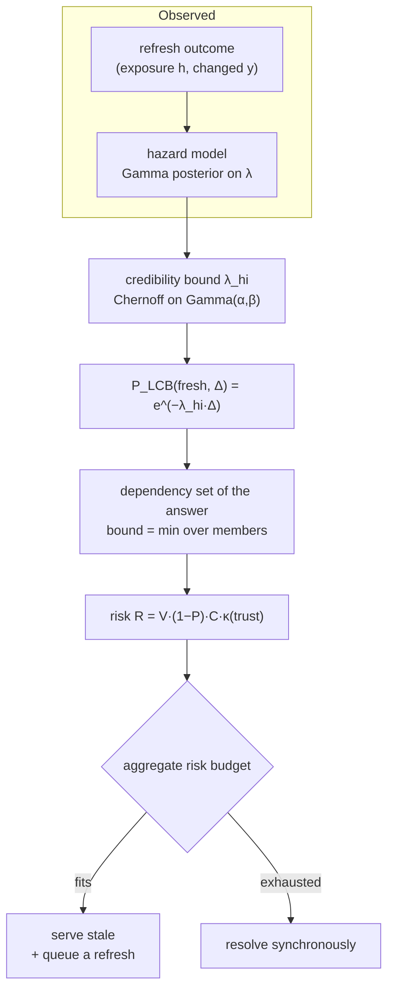

# Risk-constrained, dependency-consistent cache refresh

This page is the design document for the part of RecurseX that is not "a
careful implementation of known techniques". It replaces the earlier
"stability + popularity + score" story, and it explains what was wrong with
that story rather than quietly deleting it.

Nothing on this page claims to invent serve-stale or prefetch. RFC 8767
describes serve-stale, Unbound has prefetched near-expiry records for years
(its classic rule is "remaining TTL below 10 % of the original"), and the
idea of measuring record change behaviour is not new either. What is new
here is a *specific* combination:

1. the refresh model is a **posterior over a rate**, and every decision uses
   a **one-sided credibility bound** on it rather than a point estimate;
2. stale service is gated by a **risk functional** with declared consequence
   classes and an **aggregate budget**, and never by popularity;
3. the safety bound of an answer is the **weakest link of a dependency set**,
   and the refresh scheduler is derived from that fact rather than from a
   TTL fraction;
4. the whole thing is **falsifiable** — Brier score, log loss and a
   reliability table are part of the shipped code, not of the evaluation
   script.

## 1. Why the old model could not be fixed

The previous model kept a per-entry EWMA "stability" in `0..1` derived from a
count of refreshes and a count of changes. Three defects:

**It was not a probability.** Nothing could be said about what `0.93` meant,
so the thresholds compared against it (`stale_refresh_stability = 0.85`) had
no statistical content, and they encoded the traffic the weights had been
chosen against. Worse, they *looked* principled.

**It ignored the sampling cadence.** Ten looks at a name spaced two seconds
apart and ten looks spread over ten hours produced the same score. They are
not the same evidence, and no choice of `α` in the EWMA makes them so.

**It could not be conservative.** An EWMA starts at a neutral `0.5` and moves
towards what it has seen, so a name observed twice and never changed looked
*more* trustworthy the less it had been watched — the failure mode is
exactly inverted in the low-sample regime, which is the regime a resolver
spends most of its life in.

## 2. The observation model

Let changes to an RRset arrive as a Poisson process with unknown rate
`λ > 0` (changes per second). An observation is an exposure `h` since the
previous look, and an outcome `Y ∈ {0,1}`:

$$
\Pr(Y = 1 \mid \lambda, h) = 1 - e^{-\lambda h},
\qquad
\Pr(Y = 0 \mid \lambda, h) = e^{-\lambda h}
$$

so a whole history has likelihood

$$
\mathcal{L}(\lambda) = \prod_k \bigl(1 - e^{-\lambda h_k}\bigr)^{Y_k}\,
\bigl(e^{-\lambda h_k}\bigr)^{1 - Y_k}
$$

Two things this does **not** do, both deliberate:

* It does not assume the `h_k` are equal. They never are — the cadence is set
  by cache pressure, traffic and the scheduler, and a model that pretends
  otherwise is measuring the scheduler.
* It does not read `Y = 0` as "nothing happened". `Y = 0` says no
  *observable* difference was found at that sample. A change that came and
  went between two samples is invisible, which is precisely why the output is
  a distribution and not a counter. `HazardModel` therefore keeps no "change
  count" in its state at all; `counts()` exists for diagnostics and the
  persistent snapshot, and is documented as a *sampling* statistic that must
  not be compared to a threshold.

### The conjugate update, and its honest first-order scope

`λ` is a rate, so its conjugate prior is `Gamma(α, β)`. The exact update for
the likelihood above is not in the Gamma family, but in the regime a resolver
operates in — the data changes on a scale of hours, we sample on a scale of
minutes, so `λh ≪ 1` — we have `1 − e^{−λh} ≈ λh`. To first order, an
observation contributes `h` units of exposure when `Y = 1` and **zero**
information about `λ` when `Y = 0`. The Gamma update

$$
\alpha \leftarrow \alpha + Y, \qquad \beta \leftarrow \beta + h
$$

is the first-order-correct rule under that regime, and `hazard.rs` says so
instead of implying exactness. The bias is in the direction of *more*
confidence for a set whose `λh` is not small — which is the same as saying,
for a set whose observations are mostly `Y = 1`, where the rule is exact.

The prior is anchored to the authority's own claim: `α₀ = 1`,
`β₀ = α₀ · T` where `T` is the observed TTL. That gives prior mean `1/T` —
"one change per TTL" — which uses the TTL for what it is (a *claim*) rather
than treating it as a measurement, and keeps the prior weak enough that a
handful of honest observations moves it.

### Non-stationarity, and the anti-forgery bound that falls out of it

DNS data is not stationary: zones republish, CDNs move, delegations change.
Evidence from a week ago should not weigh like evidence from a minute ago.
So the **evidence** — not the prior — is exponentially forgotten with time
constant `τ`:

$$
\gamma = e^{-h/\tau}, \qquad
a \leftarrow \gamma a + w\,Y, \qquad
b \leftarrow \gamma b + w\,h
$$

with `α = α₀ + a`, `β = α₀T + b`.

This has a consequence worth stating on its own. With a fixed cadence `h`,
`b → w·h/(1 − γ) ≈ w·τ`: **forgetting puts a hard ceiling on accumulated
evidence**, so no quantity of refreshes — honest or forged — can drive `λ`
towards zero, and `P_LCB` is therefore strictly below 1 for every entry that
has ever existed. An attacker in a position to answer our refreshes (a
poisoning position) cannot manufacture unbounded confidence that a name never
changes, because the model never accumulates unbounded confidence in
anything. This is a structural property of the update rule, not a check
bolted on afterwards, and `hazard.rs` has a test
(`confidence_saturates_because_forgetting_bounds_exposure`) that runs 100 000
observations and asserts the ceiling holds.

The observation weight `w` is the second half of the same defence: a refresh
whose answer was accepted on the strength of an ID, port and 0x20 case alone
is worth `0.5` of an authenticated one (`UNVERIFIED_OBSERVATION_TRUST`), and
because `w` scales the *ceiling* as well as the rate, an unauthenticated
channel can never buy the same confidence no matter how long it is observed.

### Failures are not evidence

A refresh that times out teaches us nothing about the RRset. Recording it as
`Y = 0` would be the single most dangerous thing this module could do: an
unreachable upstream would masquerade as a stable zone, and a resolver that
cannot reach the authority would become *more* willing to answer from memory.
`HazardModel::observe_failure` decays the evidence (time passed, so it is
older) and moves nothing else.

## 3. From a posterior to a decision

The decision layer never uses the posterior mean. It uses a one-sided upper
credibility bound on `λ` at level `1 − δ` and evaluates the survival
probability at that worst case:

$$
P^{\mathrm{LCB}}(\text{fresh}, \Delta)
= \inf_{\lambda \in \mathrm{CI}_{1-\delta}} e^{-\lambda \Delta}
= e^{-\lambda_{\mathrm{hi}} \Delta}
$$

Read that as: *even taking the most pessimistic change rate still consistent
with what we have observed, the probability this data is correct `Δ` seconds
from now is at least this much.* That is a statement a safety argument can be
built on.

`λ_hi` is the exact Chernoff bound on a Gamma law,

$$
\Pr(\Lambda \ge x) \le e^{\alpha - \beta x}\left(\frac{\beta x}{\alpha}\right)^{\alpha},
\qquad x > \frac{\alpha}{\beta}
$$

solved for `x` by bisection. Two properties make it the right tool here:

* It is valid for **every** `α > 0`, including `α < 1` — the low-evidence
  regime where a normal approximation is simply wrong. Small samples are
  conservative *by construction*: with no evidence the bound is wide, and
  with no information at all (`α ≤ 0` or `β ≤ 0`) it is `+∞`, so
  `P_LCB = 0` and no stale answer is authorised.
* It is always `≥` the posterior mean, so it can only ever be the
  conservative side of a point estimate.

The `exp` and `ln` this needs are implemented in `float.rs` for `no_std`
(`core` has neither), and their accuracy is asserted against C-library
reference values that were *generated*, not transcribed.

The module also reports the exact posterior-predictive `(β/(β+Δ))^α`. It is
never used to decide anything; it is reported because the gap between it and
the bound *is* the price of the guarantee, and a calibration study measures
against it.

### What confidence buys, measured

With `τ = 1 day`, `T = 300 s` and `δ = 0.05`:

| evidence | `λ_hi` (/s) | `P_LCB` over 60 s |
|---|---|---|
| none (prior only) | 1.9e-2 | 0.32 |
| 1 hour watched, unchanged | 1.3e-3 | 0.93 |
| 1 day watched, unchanged | 6.6e-5 | 0.996 |

Note the third row: `λ_hi` is not zero and `P_LCB` is not one. A day of
perfect stability is worth about 0.996 over a minute — which is a number a
policy can be argued about, and which never becomes "certain".

### Scheduling

The next look is scheduled by the model, not by a percentage of a TTL:

$$
h^\* = \operatorname{clamp}\left(-\frac{\ln p^\*}{\lambda_{\mathrm{hi}}},\;
h_{\min},\; h_{\max}\right)
$$

i.e. "sample again while I am still `p*` sure the data I hold is correct".
An entry about which little is known is sampled often; an entry with a long,
well-observed life is sampled rarely. A short TTL does not by itself buy a
short interval, and a long TTL does not by itself buy a long one — only
evidence does.

## 4. Value and risk are different questions

The tempting gate for serve-stale is *"is the name popular?"*. It is wrong,
and wrong in the direction that hurts. Popularity measures the **benefit** of
an answer and says nothing about its **safety**, so applying it means the
busiest zone in a deployment is the one most likely to be answered from a
copy that a decommissioned nameserver or a revoked key has invalidated. The
failure is correlated with traffic, which is the shape of an outage.

So the two questions are answered separately and only then combined.

**Value** — expected saved latency, in milliseconds. It decides what is worth
refreshing, what is worth keeping, and in what order the refresh budget is
spent. It is *not* a safety input, and `planner.rs` has a test named
`estimator_population_is_not_required_for_safety` whose only purpose is to
make a future change that reintroduces the dependency have to delete it
deliberately.

**Risk** — how much harm the old answer can do:

$$
R_i(a) = V_i \cdot \bigl(1 - P^{\mathrm{LCB}}_i(\text{fresh}, a)\bigr)
\cdot C_i \cdot \kappa(\text{trust}_i)
$$

* `C_i` — a **consequence coefficient** by role. The default ladder:
  ordinary A/AAAA = 1, CNAME/DNAME = 5, MX/SRV/TLSA/CAA/SVCB/HTTPS = 25,
  NS / glue / delegation = 100, DNSKEY/DS/RRSIG/NSEC/NSEC3 = ∞ (never stale).
  The same A record is `Low` as answer data and `Critical` as glue, because
  its staleness there poisons every later query under that zone.
* `κ` — a **trust penalty**: 1 for a chain anchored in a configured trust
  anchor, 2 for signature-verified, 5 for unverified, 10 for indeterminate.
  Unauthenticated data needs a much lower staleness probability to be
  served, because its error could have been manufactured.
* `V_i` — the hit's value, floored at `value_floor_ms` so an entry with no
  estimator history never looks free.

Because `R` carries the units of `V`, an aggregate constraint is meaningful:

$$
\mathbb{E}\Bigl[\sum_i R_i(a_i)\Bigr] \le B_{\text{risk}},
\qquad
\sum_i \rho_i \le B_{\text{refresh}}
$$

`RiskLedger` is the first constraint as a leaky bucket charged with the
*ex-ante* bound at decision time. Charging the conservative bound rather than
the realised harm means the true spend is always below the reported one and
the reported one is auditable from the log alone; the invariant is that the
sum of admitted risks over any window cannot exceed
`capacity + rate × window`.

`RefreshBudget` is the second, a token bucket charged at the single point
where a refresh is actually spawned — so every caller (maintenance prefetch,
serve-stale refresh, dependency propagation) funnels through it and the
constraint holds by construction rather than on average. Both are exposed as
live counters, including the denial counts, because "the policy is the
constraint" and "the network is the constraint" need different fixes.

## 5. Dependency consistency

A resolver never serves one RRset; it serves a final answer assembled from
several entries, each resolved at a different time. The answer is correct
only if all of them are, and a per-entry view cannot say that.

For an answer `A` with dependency set `D(A)`:

$$
P(A \text{ servable}) \le \min_{v \in D(A)} P^{\mathrm{LCB}}(v \text{ fresh})
$$

The minimum is the only sound combination without an independence
assumption, and the independence assumption is usually false — one
authoritative republish changes a CNAME and its target in the same instant.
`Provenance::independent_bound()` computes the product anyway, as a
diagnostic, and the gap between the two is itself interesting.

Sorting the dependencies by freshness gives a slightly uncomfortable result:
**refreshing anything except the bottleneck cannot raise the bound at all.**
A scheduler that prefetches every expiring member of a chain spends the whole
budget and improves the weakest-link bound by exactly zero whenever the same
member stays weakest. `Provenance::refresh_plan` therefore returns them
bottleneck-first, and `risk_reduction` reports what each would actually buy,
so a caller can stop when the marginal refresh stops mattering.

A dependency set is capped, and the cap is implemented carefully: `bound()` is
a minimum, so *dropping* a member can only raise it, and raising it is the one
optimistic error a safety bound must never make. The implementation instead
retains the **weakest** `cap` members and folds the minimum of everything
discarded into a residual floor, so the reported bound is *identical* to the
untimed set's. Trimming costs memory, not soundness.

`crate::alias` and `crate::provenance` coexist rather than one being derived
from the other: the alias graph is a global **reverse** index ("what becomes
invalid when this changes", needed for invalidation), and provenance is a
per-answer **forward** set ("what must be true for this answer to be
serveable", needed for the decision).

## 6. ECS partitions

The cache is partitioned by the **scope the answering server declared**, not by
the prefix the requester happened to ask with:

| stored under | readable by |
|---|---|
| the global partition (no ECS) | any requester |
| an ECS scope of `S` bits | requesters with prefix `P ≥ S` whose address matches the first `S` bits |

Three rules make that work, and each of them is enforced somewhere the mistake
cannot be made quietly:

* **A requester that sent no ECS carries no partition.** Its key has
  `ecs: None`, so it cannot read a scoped entry — not because a check says so,
  but because the key type has no way to express "the answer for someone
  else's subnet". A resolver that files ECS answers under the global key (which
  is what an insert path that ignores the partition does) is advertising ECS
  support while handing subnet-specific answers to everyone.
* **The effective scope is `min(SCOPE, SOURCE PREFIX-LENGTH)`** (RFC 7871
  §7.3.1). A server may return a *wider* scope than the resolver asked about,
  but the answer was only ever computed for the network in the query, so
  trusting the wider claim would assert a validity we have no evidence for.
* **A scope-0 answer is a global answer.** A response whose SCOPE
  PREFIX-LENGTH is 0 — or one that arrives with no ECS option at all in reply
  to a query that carried one (RFC 7871 §7.2.2) — is valid for every client, so
  it is filed in the global partition. That is a *repair* rather than a
  restriction: scoped caching fragments the cache, and a scope-0 answer heals
  the fragment.

The lookup is a walk from the requester's own prefix down to 1 and then the
global partition, first hit wins. It is bounded by the requester's prefix
length and stops at the first match, so a client whose answer was cached at
exactly the scope it asked with pays one map lookup.

One detail that is easy to get wrong and is worth a test of its own: the
address in a partition key is exactly `ceil(prefix / 8)` octets (RFC 7871 §6),
so the *octet count is part of the partition's identity*. A truncation helper
that preserved the input's length would map `10.0.0.0/24` and `10.0.0.0/25`
onto the same four bytes — two different scopes, one key, silent over-sharing.

## 7. What this does *not* claim

* It does not claim a new serve-stale mechanism. RFC 8767 is implemented as
  written, including its 30-second recommendation for the TTL of a stale
  answer.
* It does not claim the coefficients, the budget, or the forgetting constant
  are correct for anyone else's deployment. They are declared operating
  points. What is not negotiable is that they are separate from the value
  signal and that they are what decides stale service.
* It does not claim the Poisson assumption is true. It claims it is
  *checkable*: `calibration.rs` ships Brier score, log loss and a reliability
  table, and the point of those is to find out when the assumption has
  stopped holding.
* The regime where `P_LCB` is useful is the regime where an entry has real
  exposure. Below `min_evidence_secs` of effective exposure the planner
  refuses to predict at all and resolves synchronously, which is slower and
  honest.

## See also

- [Value of information](Value-of-Information.md) — the other half of the
  scheduler: which due entry the next refresh token is spent on, priced in the
  same risk units
- [Cache admission & refresh math](Cache-Admission.md)
- [DNSSEC](DNSSEC.md) — the verification ladder this risk model is keyed on
- [Testing & verification](Testing.md)